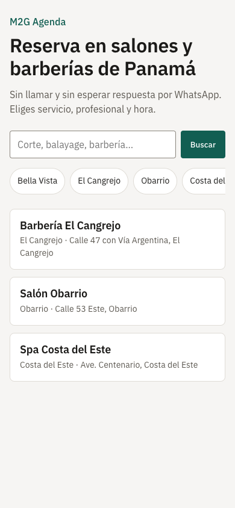
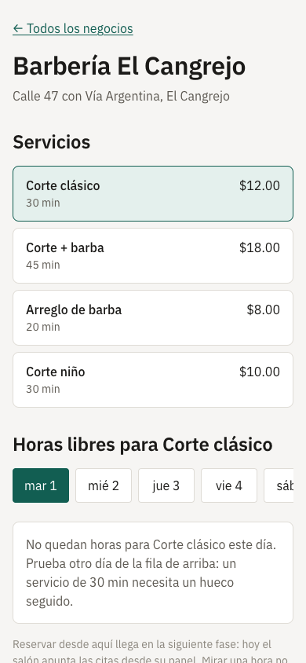
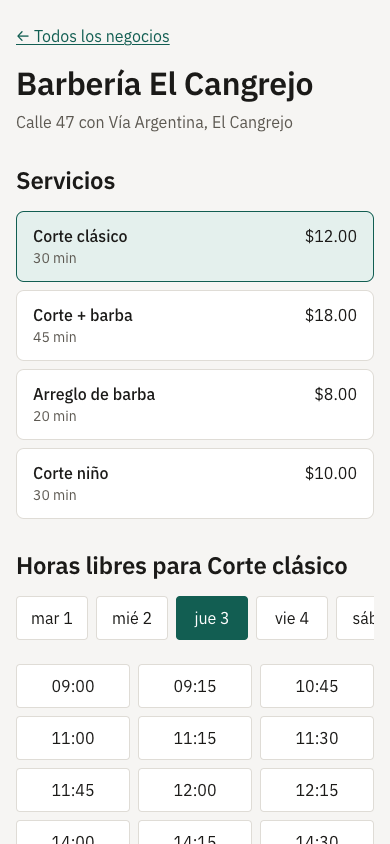

# Entrega — Estado: fases 0 y 1 construidas, fase 2 a medias

> **Qué es esto.** Lo que hay hecho, cómo verlo funcionando en tu máquina, qué falta y qué
> necesito de ti. Escrito el 1 de septiembre de 2026.

---

## 1. Cómo levantarlo

Hacen falta **Docker**, **[uv](https://docs.astral.sh/uv/)** y **pnpm**. **Ninguna credencial**:
WhatsApp, la pasarela y los mapas tienen implementación de desarrollo, así que el stack arranca
y las pruebas pasan sin una sola clave.

```bash
cd ~/Desktop/kraken/m2g-bookings
cp .env.example .env      # no hay que rellenar nada para trabajar en local
make arriba               # levanta todo, migra desde cero y carga los datos de ejemplo
```

Luego, en otra terminal, la web:

```bash
pnpm install
pnpm --filter @agenda/web dev     # http://localhost:3000
```

| Qué | Dónde |
|---|---|
| Marketplace y perfiles | <http://localhost:3000> |
| Panel del negocio | <http://localhost:3000/entrar> |
| Documentación de la API | <http://localhost:8000/docs> |

### Credenciales de prueba

**No hay contraseñas.** Se entra con el teléfono y un código de seis dígitos que, **en local**,
la propia pantalla te enseña —porque todavía no existe el canal de WhatsApp—.

Los teléfonos de los dueños los imprime el seed. El de la barbería sale así:

```bash
docker exec m2g-agenda-db-1 psql -U agenda_owner -d agenda -tAc \
  "select u.phone_e164 from memberships m join users u on u.id=m.user_id
   join businesses b on b.id=m.business_id where b.slug='barberia-el-cangrejo'"
```

Con ese número, `/entrar` → te enseña el código → entras al panel.

---

## 2. Lo que hay, visto en el móvil

Todas las capturas están tomadas **a 390 px**, que es el ancho que manda el encargo.

| | |
|---|---|
|  |  |
| **La portada.** Los tres salones publicados; el cuarto, en borrador, no aparece — y no porque el código lo filtre, sino porque la política de la base no se lo enseña al rol público. | **El perfil.** Servicios con precio y duración, y el día que elijas. Aquí no hay horas porque es de noche y el salón ya cerró: el estado vacío dice qué pasa y qué hacer. |
|  |  |
| **Las horas de verdad.** 09:00, 09:15… y luego 10:45: el hueco de 09:30 a 10:30 es una cita del seed, y las 13:00 son el almuerzo del barbero. Esos agujeros son la prueba de que el motor está mirando la agenda, no pintando una rejilla. | **Entrar.** Teléfono y código, sin contraseña. En local la pantalla enseña el código porque no hay canal todavía. |

---

## 3. Qué está hecho

**El motor de disponibilidad**, que es donde se juega el producto. Núcleo puro con **69 pruebas**
que fijan los casos que rompen este tipo de motor: la rejilla marca comienzos y no duraciones,
el buffer posterior tiene que caber antes del cierre, el multi-servicio necesita un bloque
continuo, el spa que cierra a las 00:30 ofrece huecos después de medianoche, y el mismo código
resuelve el cambio de hora de Madrid aunque Panamá no lo tenga.

**La imposibilidad de doble reserva, garantizada por PostgreSQL.** Dos transacciones
simultáneas —y diez— dejan pasar exactamente una cita. No es un `if` en el código: si mañana
alguien reescribe la reserva y se olvida de comprobar la disponibilidad, sigue sin poder
crearse un solape.

**El aislamiento entre negocios.** Con el negocio fijado, una consulta sin `WHERE` no ve al
salón de al lado, ni nombrando su identificador, ni en la agenda, ni en las fichas de cliente.
Y sin negocio fijado no se ve nada, que es lo que protege a los trabajos en segundo plano.

**El ciclo completo de un salón**: entrar por teléfono, crear el negocio, ponerle horario,
servicios y equipo, agendar un walk-in, moverlo, marcarlo atendido o no-show. Y la puerta de
publicación, que se niega diciendo exactamente qué falta.

**El marketplace**: búsqueda por texto, zona y cercanía con la fórmula de ranking —pesos en base
de datos, no en el código— y perfiles renderizados en servidor con sus datos estructurados.

**Las notificaciones**: cola idempotente donde la clave sale del hecho y no del reloj, así que
el planificador puede ejecutarse dos veces sin que nadie reciba dos recordatorios.

**En números:** 68 tablas, migración desde base vacía sin un paso manual, seed con cuatro
salones panameños y 96 citas, 19 endpoints, **107 pruebas en verde** (14 contra un PostgreSQL
real) y lint limpio.

---

## 4. Qué falta

| Falta | Fase | Por qué no está |
|---|---|---|
| Que un salón real lo use un día entero | 1 | Es el criterio de «hecho» de la fase y no lo puede firmar el equipo |
| Reservar desde el lado del cliente | 2 | Hoy la cita la mete el negocio. El motor y el perfil ya están; falta el flujo de tres pantallas |
| Reviews, favoritos y mapa | 2 | El modelo de datos y el rating bayesiano están; falta la interfaz y los endpoints |
| Subida de fotos | 1 | Necesita almacenamiento compatible con S3. Hoy la puerta de publicación pide la foto y no hay dónde subirla |
| Back-office, ads y app | 3, 4 y 5 | Fuera de este encargo |

Y una deuda técnica que conviene no olvidar: **el token de sesión vive en `localStorage`**. Lo
correcto es una cookie `HttpOnly` puesta por el servidor. Se acepta hoy porque el acceso caduca
en quince minutos y el refresco es revocable, no porque esté bien.

---

## 5. Lo que necesito de ti

**Una cosa urgente y tres que pueden esperar.**

**1. La cuenta de Meta WhatsApp Cloud API.** Es lo único que bloquea de verdad. La verificación
de la empresa y la aprobación de las plantillas tardan semanas, y el criterio de «hecho» de la
Fase 1 depende de que al cliente del salón le llegue el recordatorio. Todo lo demás está
construido y probado contra el proveedor de desarrollo, pero **el canal real está sin
verificar** y así seguirá hasta que exista la cuenta.

**2. Aprobar la Fase 0.** Su criterio de hecho es literalmente tu aprobación. Está todo escrito
en `docs/arquitectura/` y `docs/diseno/`; si algo no te cuadra, cambiarlo ahora cuesta un ADR y
dentro de dos meses cuesta una migración.

**3. Tres decisiones de política**, en `docs/arquitectura/fase-0-descubrimiento.md` §3.4: qué
pasa con el texto de una opinión cuando su autor borra la cuenta, cuánto se guarda el registro
de auditoría y cuánto hay que conservar las facturas en Panamá. Mientras tanto se aplica el
valor conservador y queda marcado. Ninguna bloquea construir; las tres tienen que estar escritas
**antes de que haya datos reales de personas**.

**4. Lo de siempre, cuando toque:** el nombre comercial y el dominio (D1), el proveedor de
mapas por su coste (D8) y la pasarela (D5). Ninguno frena nada ahora mismo.

---

## 6. Cómo comprobarlo tú

```bash
make pruebas       # 107 pruebas, incluidas las de concurrencia contra Postgres
make lint          # formato y revisión
make reiniciar     # borra la base y vuelve a montar todo desde cero
```

Si `make pruebas` no encuentra base de datos, **falla y lo dice**. No se salta las pruebas en
silencio, que es como un corredor sale en verde sin haber probado nada.
