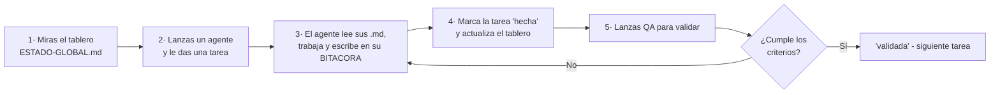

# Equipo de agentes de IA — guía de desarrollo de Bukeo

> **El documento más importante para construir el producto con IA.** Explica, para alguien que **nunca ha trabajado con agentes**, cómo se trabaja con ellos y —fase a fase— **qué agentes lanzar, para qué y qué validar** antes de seguir.
>
> **Aquí no se lanza nada.** Esto es la documentación del sistema. El director decide cuándo y a quién lanzar, **de uno en uno o en grupos pequeños** — o **deja que el orquestador paralelice** lo que sea seguro (ver §9).
>
> **Qué se está construyendo:** una plataforma de reservas y marketplace de belleza y bienestar para Panamá, **gratis para el negocio**. El *qué* está en [`../BRIEF-PRODUCTO.md`](../BRIEF-PRODUCTO.md); el *cómo* y el orden, en [`../../PROMPT-CONSTRUCTOR.md`](../../PROMPT-CONSTRUCTOR.md). Si chocan, **manda el brief**.

---

## 1. La idea en una frase

Un **agente** es una instancia de IA (Claude Code) con un **rol fijo** (DevOps, Backend, etc.), su **lista de tareas** y su **memoria escrita en archivos**. El director es el **director de orquesta**: decide a quién pone a trabajar, revisa lo que entrega y da paso al siguiente. Los agentes **no se lanzan solos**.

**El principio rector:** la memoria vive en los archivos, no en el chat. Un agente arranca leyendo sus `.md` y entiende quién es, qué le toca y en qué estado está todo. Si el chat se reinicia, **otro agente nuevo retoma** leyendo esos mismos archivos.

---

## 2. Cómo trabajar con los agentes

### Tu papel (director)
No programas: **coordinas**. En cada paso: (1) decides qué agente lanzar, (2) le das su tarea, (3) **revisas lo que entrega** y (4) dejas que **QA/Validador** lo confirme antes de avanzar. Si no entiendes algo, **pídelo en español llano**.

### El ciclo de una tarea (siempre el mismo)

### Cinco reglas de oro para el director
1. **Aquí se empieza por el Arquitecto, no por DevOps.** La infraestructura y el despliegue **no son de este equipo** (los lleva Luis): lo que sí es nuestro es el entorno local, y eso llega en el bloque 1.a. Antes va el diseño, porque *la arquitectura va antes que el código*.
2. **Un foco cada vez.** Lanza un agente, deja que termine, valida, pasa al siguiente. *(El orquestador puede paralelizar varias tareas a la vez de forma segura — §9 — pero sigues lanzando **un** orquestador, no cinco agentes a mano.)*
3. **Nada pasa a "validada" sin QA.** "Hecha" = el agente cree que terminó. "Validada" = QA lo comprobó. Y en lo que es interfaz, **comprobar es mirarlo en el navegador a 390 px**, no ver un build verde.
4. **Si dos agentes tienen que tocar lo mismo, que se avisen en el tablero** ([`ESTADO-GLOBAL.md`](ESTADO-GLOBAL.md)) antes. Cada agente manda en su carpeta.
5. **Seguridad y Testing te acompañan todo el camino**, no son "una fase": los lanzas dentro de cada bloque. En este producto, Testing entra **antes** que Backend en el motor de disponibilidad: las pruebas se escriben primero.

### Cómo lanzas un agente, en la práctica
Cada agente tiene una **definición de subagente** en [`.claude/agents/`](../../.claude/agents/), con el prefijo `agenda-`. Para ponerlo a trabajar le dices algo como *"actúa como `agenda-backend` y haz la tarea BE-T004"*. Lo primero que hace es **leer sus archivos** (su `AGENTE.md`, `TAREAS.md`, `BITACORA/` y el tablero). No tienes que recordarle el contexto: está en los archivos.

**Un agente que se topa con algo no decidido para y escala. No elige por Luis.** Las cuatro cosas que no decide el equipo están en [`../../context/restricciones.md`](../../context/restricciones.md) §8.

---

## 3. Guía de lanzamiento por fase

> Derivada de las **fases del brief** ([`../BRIEF-PRODUCTO.md`](../BRIEF-PRODUCTO.md) §9) y del orden del encargo. Este encargo cubre las **fases 0, 1 y 2**; las fases 3 a 6 se encargan después. Cuando exista `../arquitectura/fase-5-plan-de-sprints.md`, esta sección se reconcilia con él.
>
> Leyenda de papel: 🟢 **protagonista** · 🔵 **apoyo** · 🟣 **transversal** (acompaña, revisa).
>
> **No se empieza una fase sin cerrar la anterior.**

### Fase 0 · Diseño

**Objetivo:** que esté decidido por escrito **qué se construye y con qué forma**, antes de escribir una línea de producto. **Termina cuando Luis lo aprueba**, no cuando el equipo lo dé por bueno.

| Orden | Agente | Para qué |
|---|---|---|
| 1 | 🟢 **Arquitecto** | Los ADR (14 escritos) y los documentos de fase: descubrimiento, requisitos y MVP, **modelo de datos**, **motor de disponibilidad con sus casos límite**, diagramas de sistema y plan de sprints |
| 2 | 🔵 **Ingeniería de Software** | Convertir la arquitectura en especificación: actores, secuencias y reglas de **onboarding**, **disponibilidad** y **ciclo de la reserva**, con sus diagramas |
| 3 | 🔵 **Mockuper** | El **design system** con tokens y los flujos navegables **a 390 px**: registrar un negocio, la agenda del día, reservar. Va **por delante** del Frontend |
| — | 🟣 **Seguridad** | Que el modelo de datos nazca con la Ley 81 dentro: consentimiento, retención, borrado de cuenta y **qué se anonimiza al borrar** |

**Qué validas tú antes de la Fase 1:**
- [ ] Puedes leer el **modelo de datos** y entender dónde vive un negocio, una reserva y un bloqueo, y **qué columnas se dejaron preparadas para v2** (multi-sede, recursos, depósitos, recepción).
- [ ] El documento del **motor de disponibilidad** contesta, uno a uno, los ocho casos límite del encargo — incluido el buffer que cruza el cierre y el servicio que no cabe antes de cerrar.
- [ ] Ves el flujo de **reservar** en el mockup y **cuentas tres pantallas** después de elegir servicio, no cinco.
- [ ] El design system se ve **a 390 px**, en **modo claro**, y no hay ni un color escrito fuera de los tokens.
- [ ] **Tú apruebas la fase.** Es el criterio de «hecho» literal del brief.

### Fase 1 · El núcleo — y es lo que de verdad importa

**Objetivo:** que **un salón real pueda operar su agenda entera desde un teléfono**. Ese es el criterio, no «los endpoints responden». Va en seis bloques, y el orden importa.

#### 1.a Cimientos

| Orden | Agente | Para qué |
|---|---|---|
| 1 | 🟢 **DevOps** | `infra/local` con `docker-compose.yml` de **un solo comando**, imagen `postgis/postgis:16-3.4`, Redis, worker y web; `Makefile`; `.env.example` documentado variable a variable. **Infra de producción y despliegue no son de este equipo** |
| 2 | 🔵 **Backend** | El esqueleto de la API: `/api/v1`, forma única del error con `codigo` estable, identificadores UUID v7, paginación por cursor, idempotencia y salud. **Sin una sola regla de negocio** |
| — | 🔵 **Testing** | El andamiaje de pruebas **contra un Postgres real** —nunca SQLite— y la prueba de aislamiento **en su forma vacía** |
| — | 🟣 **Seguridad** | Ningún secreto en el repositorio; el diff se escanea **en español y en inglés** |

**Qué validas tú:** `make arriba` levanta el stack completo en una máquina limpia y **no hay que adivinar nada** · las migraciones corren desde cero · `make pruebas` **falla si no hay base de datos**, en vez de saltárselas en silencio · ningún secreto en claro.

#### 1.b Identidad y onboarding

🔵 **Ingeniería** especifica → 🟢 **Backend** construye (OTP con hash, sesión con refresco revocable, `memberships`, negocio activo explícito, **RLS desde la primera migración**) → 🟣 **Seguridad** revisa → 🔵 **Testing** llena **la prueba crítica de aislamiento**.

**Qué validas tú:** una misma cuenta es cliente **y** dueña de un salón, y cambiar de contexto es explícito · un profesional del negocio A **no ve ni una fila** del negocio B aunque tenga membresía en los dos, **con el filtro del código desactivado a propósito** · registrar un negocio lleva **menos de diez minutos desde el móvil**.

#### 1.c Catálogo: servicios y equipo

🟢 **Backend** construye servicios con duración, precio y **buffers**, variantes, asignación de servicios a profesionales, horarios propios del profesional, descansos y bloqueos puntuales y recurrentes.

**Qué validas tú:** un profesional puede tener **horario distinto del negocio** —que es el caso normal, no la excepción— · el seed trae datos que se parecen a un salón panameño: «Corte + barba · 45 min · $18», «Balayage · 3 h · desde $120». **Nunca «Servicio 1 · 100,00»**.

#### 1.d El motor de disponibilidad — **la pieza donde se juega el producto**

| Orden | Agente | Para qué |
|---|---|---|
| 1 | 🟢 **Testing** | **Las pruebas se escriben antes que el motor.** Los ocho casos límite, más la concurrencia real: dos transacciones simultáneas contra un Postgres de verdad |
| 2 | 🟢 **Backend** | El motor, y la **restricción de exclusión** sobre el rango bloqueado con los buffers dentro. La no doble reserva es transaccional, **no un `if`** |

> ### 🚦 Puerta de parada: aquí se para y se enseña
>
> **Cuando el motor de disponibilidad esté con sus pruebas en verde, el equipo PARA y lo enseña antes de montar una sola pantalla encima.** No es una formalidad: si ese motor está mal, todo lo que se construya encima hay que rehacerlo. Lo que se enseña es la **lista de casos cubiertos** y las pruebas pasando, no una captura.
>
> **No se abre el bloque 1.e sin que Luis haya visto esto.**

**Qué validas tú:** dos clientes confirmando el mismo hueco **a la vez y bajo carga** dan **una reserva y un error claro**, nunca dos citas · y con la comprobación de código desactivada a propósito, **la base de datos rechaza la segunda igual** · un servicio de tres horas **no cabe** en el hueco de las cinco de la tarde y el motor lo dice · cambiar el horario del negocio **cuando ya hay reservas dentro** no las borra en silencio.

#### 1.e Agenda y reservas manuales

🔵 **Mockuper** por delante → 🟢 **Frontend Web** construye la agenda de día y semana, la reserva manual de mostrador o teléfono, mover y reprogramar → 🟢 **Backend** cierra la máquina de estados de la reserva.

**Qué validas tú:** **la agenda del día se usa con una mano, a 390 px, en el navegador** · la reprogramación es un evento en el historial, **no un estado final** · cancelar una cita **no está pegado** a moverla.

#### 1.f Notificaciones y ficha de cliente

🟢 **Backend** con la cola en tabla, la clave de idempotencia derivada del hecho y el planificador que **encola, no envía** → 🔵 **Testing** ejecuta cada trabajo dos veces seguidas.

**Qué validas tú:** ejecutar dos veces el recordatorio de 24 h **manda un solo mensaje** · se puede responder a «¿le llegó el recordatorio?» **sin adivinar** · el teléfono del negocio **no aparece en claro** en ninguna respuesta.

**Puerta de la Fase 1:** un salón real —tú, con un móvil— registra el negocio, carga servicios y equipo, publica, recibe una reserva, la mueve, la cancela y marca un no-show, **todo desde el teléfono**. Con capturas del flujo completo a 390 px y en escritorio.

### Fase 2 · El marketplace

**Objetivo:** que **un cliente encuentre un negocio y reserve sin que nadie le ayude, y que Google indexe los perfiles**.

| Orden | Agente | Para qué |
|---|---|---|
| 1 | 🔵 **Mockuper** | Búsqueda, ficha pública y flujo de reserva del cliente, **a 390 px** |
| 2 | 🟢 **Backend** | Búsqueda con PostGIS, taxonomía de zonas, **ranking con pesos en base de datos**, rating bayesiano, reviews y favoritos |
| 3 | 🟢 **Frontend Web** | Perfiles y páginas **categoría × zona** renderizados en servidor, con metadatos, `LocalBusiness` de schema.org y sitemap; búsqueda y mapa |
| — | 🟣 **Seguridad** | Que el teléfono **no viaje** en los listados y que el click-to-chat se resuelva en servidor; límites de ritmo contra el scraping |

**Qué validas tú antes de cerrar:** una persona que no sabe nada del producto **encuentra un salón y reserva sin ayuda** · el HTML del perfil trae el contenido **antes de ejecutar JavaScript** · **Lighthouse móvil ≥ 90** · los patrocinados van etiquetados, **como mucho 2 de cada 10**, y **no desplazan a ningún orgánico fuera de la página** · un negocio recién registrado **aparece**, porque el boost de nuevo existe.

### Lo que este equipo NO construye

**La infraestructura, la CI/CD y los despliegues los lleva Luis.** Este equipo desarrolla y valida **en local**, y a cambio deja impecable lo que él necesita para desplegar sin adivinar: `docker-compose.yml` de un comando, migraciones desde cero, `.env.example` documentado, README de arranque en pasos numerados y las pruebas corriendo con un comando.

Tampoco se construye **nada marcado v2** en el brief. Pero el modelo de datos **les deja sitio** cuando es barato: multi-sede, recursos físicos, profesional en varios negocios, depósitos y cobro al cliente final, y el rol de recepción. Una columna hoy no cuesta nada; una migración con datos vivos, mucho.

---

## 4. Cómo arranca un agente (orden de lectura)

Cuando lanzas un agente, esto es lo que él lee, en orden (ya está en su definición de subagente):

1. **Este `README.md`** — las reglas (§5) y el plan (§3).
2. **Su `AGENTE.md`** — quién es, qué le aplica, de quién depende, cómo se valida.
3. **Su `TAREAS.md`** — su backlog con el estado de cada tarea.
4. **Las últimas entradas de su `BITACORA/`** — qué se hizo ya y qué quedó pendiente.
5. **[`ESTADO-GLOBAL.md`](ESTADO-GLOBAL.md)** — el tablero del equipo.

Términos → [`GLOSARIO.md`](GLOSARIO.md). Arquitectura → [`../arquitectura/`](../arquitectura/), incluida la [`constitution.md`](../arquitectura/constitution.md) con sus **ocho garantías**. Producto → [`../BRIEF-PRODUCTO.md`](../BRIEF-PRODUCTO.md).

---

## 5. Reglas del sistema (de obligado cumplimiento, para los agentes)

1. **La memoria vive en los archivos.** Lo que no esté escrito, no existe.
2. **No se editan los ADR ya decididos.** La arquitectura (`../arquitectura/`) es la fuente de verdad. Si un agente cree que una decisión debe cambiar, lo **anota como bloqueo en `ESTADO-GLOBAL.md` y lo escala**; no la cambia por su cuenta.
3. **Cada tarea terminada genera una entrada de `BITACORA/`** (plantilla en [`PLANTILLAS.md`](PLANTILLAS.md)).
4. **Nadie toca el trabajo de otro agente sin avisar antes** en `ESTADO-GLOBAL.md`.
5. **Una tarea no pasa de `hecha` a `validada` sin el visto bueno de QA/Validador.**
6. **Al cambiar el estado de una tarea, se actualiza `ESTADO-GLOBAL.md`** en la misma sesión.
7. **Nada pendiente solo en prosa.** Lo que queda abierto va a la tabla de deuda viva del tablero, con categoría y dueño.
8. **Lo de interfaz se verifica en el navegador y a 390 px.** «Build verde» no es evidencia: la CSP, el runtime y el diseño no salen ahí.
9. **Ningún secreto en git**, ni en logs, ni en bitácoras. Todo secreto nuevo se documenta **en la misma sesión** en `.env.example` y en [`../operacion/SECRETOS-Y-VARIABLES.md`](../operacion/SECRETOS-Y-VARIABLES.md): nombre y propósito, **nunca el valor**.

---

## 6. Mapa del equipo (11 roles)

El equipo = el **Arquitecto** (diseña y coordina) + el **Ingeniero de Software** (especifica) + **5 agentes de construcción** + el **Mockuper** (diseño navegable) + **Seguridad**, **QA** y el **Orquestador** (transversales).

| Carpeta | Agente | Misión en una frase |
|---|---|---|
| [`arquitecto/`](arquitecto/AGENTE.md) | **Arquitecto / Coordinador** | Diseña y custodia la arquitectura y coordina al equipo. No construye; **lo valida Luis, no QA**. |
| [`ingenieria-software/`](ingenieria-software/AGENTE.md) | **Ingeniería de Software** | Traduce la arquitectura en requisitos y diagramas. **Especifica cada módulo antes de que se construya.** No construye. |
| [`devops/`](devops/AGENTE.md) | **DevOps / Infraestructura** | El **entorno local** de un comando, las migraciones, el seed y el `.env.example`. **El despliegue lo asume Luis**, no este rol. |
| [`backend/`](backend/AGENTE.md) | **Backend** | La API, el modelo de datos, el motor de disponibilidad, la cola y la lógica de negocio. **El protagonista de la Fase 1.** |
| [`frontend-web/`](frontend-web/AGENTE.md) | **Frontend Web** | `apps/web` con Next y SSR —marketplace, perfiles indexables, reserva y panel de negocio— y `apps/backoffice` con Vite. |
| [`mockuper/`](mockuper/AGENTE.md) | **Mockuper** | El design system con tokens y los flujos navegables **a 390 px**. Va **por delante** del Frontend. |
| [`movil/`](movil/AGENTE.md) | **Móvil** | La app Expo con modo cliente y modo negocio. **Aplazado a la Fase 5** (ver abajo). |
| [`testing/`](testing/AGENTE.md) | **Testing** | Pruebas contra un **Postgres real**, incluidas las dos críticas: aislamiento entre negocios y no doble reserva bajo concurrencia. |
| [`seguridad-compliance/`](seguridad-compliance/AGENTE.md) | **Seguridad y Cumplimiento** | 🟣 Transversal: aislamiento, OTP, teléfonos que no se exponen, datos de tarjeta que no se tocan, **Ley 81 de Panamá**. |
| [`qa-validador/`](qa-validador/AGENTE.md) | **QA / Validador** | 🟣 Audita el trabajo de todos contra sus criterios y **contra las ocho garantías**; da o niega el visto bueno. No construye. |
| [`orquestador/`](orquestador/AGENTE.md) | **Orquestador** | 🟣 Paraleliza tareas independientes en worktrees aislados y mergea con seguridad. No construye ni valida. Ver §9. |

### Roles descartados o aplazados (y cuándo se reactivan)

> Se descartan **con fecha de caducidad**, no en silencio. Reactivar un rol es recuperar su `AGENTE.md` y su `TAREAS.md` —de la plantilla en `m2g-development/plantilla-proyecto/` o del historial de git—, crear su `.claude/agents/<rol>.md` con el prefijo `agenda-` y añadir su `matcher` en `SubagentStart` y `SubagentStop` de `.claude/settings.json`.

| Rol | Situación | Por qué | Cuándo se reactiva |
|---|---|---|---|
| **Datos / IA** | **Descartado** | En las fases 0 a 2 **no hay pipeline de datos ni modelos de IA**. Lo que parecía candidato no lo es: el ranking del marketplace es **una fórmula con pesos configurables en base de datos** (ADR-0009), explicable y ajustable a mano —precisamente **porque** aprendizaje automático se descartó ahí por escrito—, y las métricas de ADM-1 son consultas del backend. Un rol sin nada que construir es una carpeta que despista. | Cuando entre **relevancia aprendida o personalización** en el ranking, precio dinámico, o detección automática de reseñas falsas. Ese día se supera ADR-0009 con un ADR nuevo y **el rol vuelve con él**. |
| **Móvil** | **Aplazado a la Fase 5** | La app es APP-1 a APP-6 y el brief la sitúa en la **Fase 5**; este encargo son las fases 0 a 2, y D15 pone además los ads (Fase 4) por delante. Construirla ahora sería construir sobre una API que todavía cambia. | En la Fase 5. Mientras tanto **su carpeta se mantiene**, porque hay decisiones de hoy que le afectan: los tokens se generan también para React Native (ADR-0013) y la API es la misma para las tres superficies (ADR-0012). `apps/mobile` **no se crea vacío** hasta entonces. |

---

## 7. Conexión con Claude Code (subagentes)

Cada agente tiene una **definición de subagente** corta en [`.claude/agents/`](../../.claude/agents/), con el prefijo **`agenda-`**. Esa definición arranca el motor y manda al agente a **leer sus ficheros** (§4). **Los `.md` de esta carpeta son la fuente de verdad**; las definiciones solo apuntan a ellos. Si divergen, mandan los `.md`.

---

## 8. Conocimiento centralizado (KB)

Este proyecto **referencia** una KB común a todos los proyectos (skills, `AGENTE.md` base, convenciones, design systems) con `--add-dir $KB_DIR`. El `INDEX.md` de la KB se carga al arrancar; cada skill se lee **bajo demanda**, solo cuando su disparador aplica. Ver [`../operacion/SECRETOS-Y-VARIABLES.md`](../operacion/SECRETOS-Y-VARIABLES.md) para la ruta `KB_DIR`.

---

## 9. Paralelizar con seguridad (el Orquestador)

Cuando hay varias tareas **independientes**, el director puede lanzar el **Orquestador** (transversal) para despacharlas a la vez sin que se pisen. El orquestador:

- Lee los `TAREAS.md` implicados más `ESTADO-GLOBAL.md` y construye el grafo de **dependencias** y **zonas**.
- Forma lotes paralelizables **solo si**: (1) sin dependencia declarada, (2) **zonas de fichero disjuntas**, (3) ambas `pendiente`, (4) sin recurso serializado compartido.
- Despacha cada tarea a su subagente de rol con **aislamiento por worktree** (`isolation: worktree`).
- **Mergea** de menor a mayor riesgo —las migraciones al final y en serie—; resuelve **solo conflictos triviales** y **escala** los no triviales.
- Es el **único** que escribe `ESTADO-GLOBAL.md` y `TAREAS.md` durante un lote, y lanza las pruebas sobre el combinado antes de pasar a QA.

**Zonas serializadas de este proyecto** — nunca dos agentes a la vez, ni siquiera con worktree, porque el merge no puede ser trivial:

| Zona | Por qué |
|---|---|
| `apps/api/migraciones` | Dos migraciones creadas a la vez chocan en el número y en el orden de aplicación. |
| `apps/api/disponibilidad` | El motor es una sola pieza con una sola verdad; partirlo entre dos agentes es garantizar una discrepancia. |
| `packages/tokens` | Es la **fuente única** del diseño: dos manos escribiendo tokens es dos design systems. |
| `docs/arquitectura/adr/` | Un ADR se escribe entero o no se escribe; además **no se editan los ya decididos**. |
| `ESTADO-GLOBAL.md` y los `TAREAS.md` | Los serializa el propio orquestador: es el único conflicto garantizado de todo lote. |

El detalle completo del protocolo está en [`orquestador/AGENTE.md`](orquestador/AGENTE.md). El estado de los lotes en vuelo vive en la sección **«Lotes en vuelo»** de `ESTADO-GLOBAL.md`.
