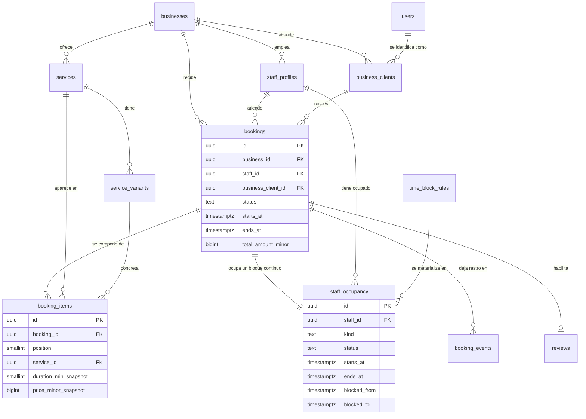

# Fase 3 · Modelo de datos — Estado: completado (Fase 0, pendiente de aprobación de Luis)

> El esquema completo de Bukeo, dominio a dominio. Es la traducción a tablas de los requisitos
> del [brief](../BRIEF-PRODUCTO.md) y de las decisiones ya tomadas en los
> [ADR 0001–0014](adr/). **Los ADR no se discuten aquí: el modelo los obedece.** Si algo de este
> documento contradice un ADR, manda el ADR y este documento está mal.

---

## 0. Cómo leer esto

Cada dominio empieza con un índice de sus tablas con tres columnas: el nombre, **si lleva RLS o no**
y el propósito en una frase. Después viene el detalle de columnas de cada tabla en bloques de
pseudo-DDL, y a continuación, en prosa, las restricciones e índices que importan y **por qué**.

No hay DDL literal de todo: sesenta tablas de DDL completo son un documento que nadie lee y que se
desincroniza con la primera migración. Sí hay **DDL literal y ejecutable** de las cinco piezas donde
un error de transcripción cuesta caro: las extensiones y la función de UUID v7, la tabla de
ocupación con su restricción de exclusión, el disparador que la mantiene sincronizada con las
reservas, las políticas RLS de ejemplo y los índices geográficos.

La columna **RLS** de los índices toma exactamente tres valores, que vienen de ADR-0002:

| Valor | Qué significa |
|---|---|
| **sí** | La tabla lleva `business_id NOT NULL` y una política que la compara contra `app.current_business_id`. Es dato de un negocio y ningún otro negocio lo ve. |
| **no · catálogo global** | Taxonomías y configuración compartida, de solo lectura para el negocio. No lleva `business_id` y no tiene sentido aislarla. |
| **no · plataforma** | Datos de una persona o del sistema, que **no pertenecen a un negocio**: un cliente es de la plataforma, no de un salón. Se protegen por identidad del usuario o por rol interno, no por tenant. |

---

## 1. Convenciones que valen para todas las tablas

### 1.1 Identificadores

**UUID v7 en todas las claves primarias** (ADR-0012). Ordenables en el tiempo —el índice primario no
se fragmenta como con UUID v4—, y no revelan cuántas reservas hay ni permiten enumerarlas, que es lo
que pasa con un `bigserial` expuesto en una URL pública.

PostgreSQL 16 no trae `uuidv7()` nativo, así que la migración inicial instala la función. La
aplicación también genera identificadores del lado de Python, porque necesita conocer el ID antes de
insertar para encadenar filas relacionadas; el `DEFAULT` de la base es la red por si alguna ruta
inserta sin darlo.

### 1.2 Tiempo

Directamente de ADR-0003, y **no se mezcla**:

- **Instantes** (`bookings.starts_at`, `notifications.scheduled_for`, todo lo que termina en `_at`):
  `timestamptz`, siempre UTC.
- **Reglas horarias recurrentes** (horario del negocio, horario del profesional, descansos, bloqueos
  recurrentes): `weekday smallint` + `time` **local**, sin fecha y sin huso.
- **La zona** vive en `businesses.timezone`, texto IANA, `NOT NULL`, con `America/Panama` por
  defecto. Es obligatoria porque el motor de disponibilidad no puede convertir una regla local en un
  instante sin ella, y porque España viene después.
- `weekday` va de 0 a 6 con **0 = lunes**. Se fija aquí para que nadie lo interprete al revés: es la
  clase de detalle que produce un horario desplazado un día y una tarde perdida buscándolo.
- Un cierre que cruza medianoche se modela con `closes_at < opens_at` en la misma fila, no en dos.

### 1.3 Enumerados

**Texto en minúsculas con guion bajo, validado con `CHECK`**, exactamente los valores que nombra el
brief. No se usan tipos `ENUM` nativos de PostgreSQL: añadir un valor obliga a `ALTER TYPE` fuera de
transacción en algunas versiones, quitarlo es imposible, y las taxonomías que el back-office tiene
que poder tocar sin desplegar (ADM-4) son tablas, no tipos.

Los valores son **los mismos en base de datos, en la API y en el cliente** (ADR-0012). En esta casa
ya se rompió un front por serializar enumerados en mayúsculas y compararlos en minúsculas; aquí hay
un solo formato y una prueba que lo fija.

El enumerado de estado de reserva es **literalmente** el de RSV-3, sin sinónimos ni abreviaturas:

```
pendiente · confirmada · completada · no_show · cancelada_cliente · cancelada_negocio
```

La reprogramación **no es un estado**: es una fila en `booking_events` y un puntero
`bookings.rescheduled_from_id`. Una cita reprogramada sigue `confirmada`.

### 1.4 Dinero

**Enteros de la unidad mínima** (`bigint`, centavos) más `currency char(3)` por fila (ADR-0010).
Nunca coma flotante y nunca `numeric` para importes: el redondeo de dinero se hace una vez, al
presentar. El símbolo que se pinta (`$`, D12) es configuración en `platform_settings`, no una
constante en el código, y el nombre comercial tampoco se mete a fuego en ninguna parte (D1).

### 1.5 Columnas de auditoría y borrado

Toda tabla de dominio lleva `created_at timestamptz NOT NULL DEFAULT now()` y, si es mutable,
`updated_at`. Las tablas cuyo borrado destruiría historia del negocio llevan `deleted_at` y se
borran de forma lógica; el resto se borran de verdad. Qué se borra y qué se anonimiza cuando un
usuario ejerce su derecho al olvido está en la sección 15, tabla por tabla, y no se improvisa
(ADR-0006 lo exige explícitamente).

### 1.6 Índices

Toda clave foránea que se usa para filtrar lleva índice; PostgreSQL **no** los crea solos y el
primer `DELETE` de un negocio con 4.000 reservas lo descubre por las malas. Los índices que se
listan en cada dominio son los que responden a una consulta real del producto, no un barrido
preventivo: un índice que nadie usa se paga en cada escritura.

### 1.7 Extensiones y utilidades — DDL literal

```sql
-- Migración inicial. Las tres extensiones son obligatorias desde el primer día
-- (ADR-0005 PostGIS, ADR-0004 btree_gist, pgcrypto para hashes y bytes aleatorios).
CREATE EXTENSION IF NOT EXISTS postgis;
CREATE EXTENSION IF NOT EXISTS btree_gist;
CREATE EXTENSION IF NOT EXISTS pgcrypto;

-- UUID v7. PostgreSQL 16 no lo trae; se instala aquí para que el DEFAULT exista
-- aunque alguna ruta inserte sin generar el identificador en la aplicación.
CREATE OR REPLACE FUNCTION uuid_generate_v7() RETURNS uuid
LANGUAGE plpgsql VOLATILE PARALLEL SAFE AS $$
BEGIN
  -- Se toma un UUID v4 aleatorio, se le sobreescriben los 48 primeros bits con la
  -- marca de tiempo en milisegundos y se corrige el nibble de versión de 4 a 7.
  RETURN encode(
    set_bit(
      set_bit(
        overlay(
          uuid_send(gen_random_uuid())
          PLACING substring(
            int8send(floor(extract(epoch FROM clock_timestamp()) * 1000)::bigint) FROM 3
          )
          FROM 1 FOR 6
        ),
        52, 1),
      53, 1),
    'hex')::uuid;
END $$;

-- Desplazamiento de un instante por un número entero de minutos.
-- Existe por una razón concreta: `timestamptz + interval` está marcado STABLE en
-- PostgreSQL (porque un intervalo con días o meses depende del huso), y una columna
-- generada exige IMMUTABLE. Con `secs =>` el intervalo no tiene componente de día ni
-- de mes, así que la suma es aritmética pura sobre el instante y sí es inmutable de
-- verdad. Esto es lo que permite que blocked_from y blocked_to sean columnas
-- generadas y persistidas por la base, como manda ADR-0004, y no calculadas por la
-- aplicación.
CREATE OR REPLACE FUNCTION desplazar_minutos(t timestamptz, minutos integer)
RETURNS timestamptz
LANGUAGE sql IMMUTABLE STRICT PARALLEL SAFE AS $$
  SELECT t + make_interval(secs => minutos * 60);
$$;

-- Lector del tenant activo. Devuelve NULL si nadie lo fijó, y una política que
-- compara contra NULL no devuelve filas: el fallo es cerrado, no abierto.
CREATE OR REPLACE FUNCTION app_negocio_actual() RETURNS uuid
LANGUAGE sql STABLE PARALLEL SAFE AS $$
  SELECT nullif(current_setting('app.current_business_id', true), '')::uuid;
$$;
```

### 1.8 Roles de base de datos

Cuatro roles, porque el aislamiento de ADR-0002 depende de que el rol de la API no pueda saltárselo:

| Rol | Quién lo usa | Qué puede |
|---|---|---|
| `agenda_owner` | Solo las migraciones | Dueño de las tablas. La aplicación nunca se conecta con él. |
| `agenda_api` | La API en modo negocio | Sujeto a RLS. **No tiene `BYPASSRLS` y no es dueño de las tablas**, así que ni un `SELECT *` sin `WHERE` se lleva datos ajenos. |
| `agenda_publico` | Marketplace y páginas públicas | Solo lectura, y solo sobre las filas publicables: negocios `publicado`, sus servicios activos, su equipo visible y sus reviews publicadas. **Nunca ve reservas ni fichas de cliente.** |
| `agenda_admin` | Back-office de M2G | Acceso amplio y **auditado**, con su propia sesión y 2FA (ADR-0006). Nunca es el mismo rol que la API pública. |

Además, **el filtro de aplicación se escribe igual** (ADR-0002): RLS es la red, no la excusa para
consultar sin `WHERE`. Sin filtro explícito el planificador elige peor y los índices por
`business_id` no se aprovechan.

---

## 2. Aislamiento multi-tenant — DDL literal de las políticas

Hay dos patrones de política y todo el esquema se reduce a ellos.

**Patrón A — tabla privada del negocio.** Es el caso normal: reservas, servicios, equipo, fichas de
cliente, ocupación. Solo la ve el negocio dueño.

```sql
ALTER TABLE bookings ENABLE ROW LEVEL SECURITY;
ALTER TABLE bookings FORCE ROW LEVEL SECURITY;   -- también para el dueño de la tabla

CREATE POLICY bookings_tenant ON bookings
  FOR ALL
  TO agenda_api
  USING      (business_id = app_negocio_actual())
  WITH CHECK (business_id = app_negocio_actual());
```

`USING` filtra lo que se lee y lo que se puede modificar; `WITH CHECK` impide **escribir** una fila
con el `business_id` de otro. Sin `WITH CHECK`, un `INSERT` con un `business_id` ajeno pasaría: la
fila entraría y luego el propio autor no la vería, que es la peor de las dos fugas porque no da la
cara. `FORCE ROW LEVEL SECURITY` es igual de importante: sin él, el dueño de la tabla se salta su
propia política y basta un despiste de conexión para vaciar la garantía.

**Patrón B — tabla del negocio con una cara pública.** El perfil de un negocio publicado lo tiene
que poder leer cualquiera, incluido Google. Se resuelve con **una segunda política para el rol
público**, no relajando la del tenant:

```sql
ALTER TABLE businesses ENABLE ROW LEVEL SECURITY;
ALTER TABLE businesses FORCE ROW LEVEL SECURITY;

CREATE POLICY businesses_tenant ON businesses
  FOR ALL TO agenda_api
  USING      (id = app_negocio_actual())
  WITH CHECK (id = app_negocio_actual());

CREATE POLICY businesses_marketplace ON businesses
  FOR SELECT TO agenda_publico
  USING (status = 'publicado' AND deleted_at IS NULL);
```

Las políticas de un mismo comando se combinan con `OR`, así que cada rol ve exactamente lo suyo y
nada más. Lo que impide que el marketplace se lleve un teléfono es doble: el rol público no tiene
`SELECT` sobre las columnas sensibles y, además, **toda respuesta pública pasa por un serializador
explícito** (ADR-0012). El número de WhatsApp no viaja en ningún listado; el click-to-chat se
resuelve con un salto en servidor que registra el clic y redirige (ADR-0007).

**La API fija el tenant dentro de la transacción**, nunca fuera:

```sql
BEGIN;
SET LOCAL app.current_business_id = '018f2c...';
-- … consultas de la petición …
COMMIT;   -- SET LOCAL muere aquí: una conexión reutilizada del pool no arrastra el tenant anterior
```

Los trabajos en segundo plano hacen lo mismo y de forma explícita (ADR-0008): un trabajador no tiene
sesión de usuario y es donde más fácil se cuela una consulta sin filtrar.

**La prueba que impide que esto se degrade.** Cada migración nueva tiene que acordarse de activar la
política, y acordarse no es un mecanismo. Se automatiza con una consulta al catálogo que Testing
ejecuta como prueba y que falla si aparece una tabla con `business_id` y sin RLS:

```sql
SELECT c.relname AS tabla_sin_rls
FROM pg_class c
JOIN pg_namespace n ON n.oid = c.relnamespace
JOIN pg_attribute a ON a.attrelid = c.oid AND a.attname = 'business_id' AND a.attnum > 0
WHERE n.nspname = 'public'
  AND c.relkind = 'r'
  AND NOT c.relrowsecurity;
-- Cero filas o la prueba falla.
```

Su hermana es la prueba de aislamiento cruzado: con el tenant A fijado, ninguna consulta a ninguna
tabla devuelve filas de B, ni siquiera para un usuario con membresía en los dos (ADR-0006).

---

## 3. Identidad y acceso

Tres piezas separadas: quién eres, cómo lo demuestras y qué puedes hacer (ADR-0006). Ninguna lleva
RLS de negocio, porque **una persona no pertenece a un salón**.

| Tabla | RLS | Propósito |
|---|---|---|
| `users` | no · plataforma | Una fila por persona; el teléfono verificado en E.164 es su identificador natural. |
| `auth_identities` | no · plataforma | Una fila por método con el que esa persona demuestra quién es. |
| `sessions` | no · plataforma | Sesión viva con su refresco opaco rotatorio y el negocio activo. |
| `otp_codes` | no · plataforma | Códigos de un solo uso, guardados con hash, con su ventana e intentos. |
| `memberships` | **sí** | Qué rol tiene un usuario en un negocio; es la unidad de permiso. |
| `admin_users` | no · plataforma | Equipo interno de M2G, aparte de los usuarios, con 2FA obligatorio. |
| `admin_sessions` | no · plataforma | Sesiones del back-office, separadas de las de la aplicación. |
| `user_consents` | no · plataforma | Prueba de consentimiento por finalidad y versión (Ley 81). |
| `privacy_requests` | no · plataforma | Solicitudes de exportación, rectificación y borrado, con su ventana de gracia. |

```sql
users
  id                  uuid PK        DEFAULT uuid_generate_v7()
  phone_e164          text NOT NULL  -- +507…, único
  phone_verified_at   timestamptz    -- sin esto no se reserva (D9)
  email               text           -- opcional; único por lower(email)
  email_verified_at   timestamptz
  full_name           text NOT NULL
  avatar_key          text           -- clave en el almacén de objetos, no una URL firmada
  locale              text NOT NULL  DEFAULT 'es-PA'
  status              text NOT NULL  DEFAULT 'activo'   -- activo | bloqueado | eliminado
  anonymized_at       timestamptz    -- lápida de Ley 81; ver §14
  created_at, updated_at
```

`UNIQUE (phone_e164)` y `UNIQUE (lower(email)) WHERE email IS NOT NULL`. El teléfono se guarda
**siempre normalizado a E.164** y esa normalización ocurre en un solo sitio: dos formatos del mismo
número son dos cuentas, y el día que pase, el cliente jura que ya tenía cuenta y tiene razón.

```sql
auth_identities
  id                 uuid PK
  user_id            uuid NOT NULL -> users ON DELETE CASCADE
  provider           text NOT NULL   -- telefono | google | apple
  subject            text NOT NULL   -- el E.164, o el "sub" del proveedor
  email_at_provider  text
  email_verified     boolean NOT NULL DEFAULT false
  created_at, last_used_at
```

`UNIQUE (provider, subject)` y `UNIQUE (user_id, provider)`. La regla de enlace es de ADR-0006 y es
de seguridad, no de comodidad: si el correo que devuelve Google **viene verificado** y coincide con
uno ya verificado en la plataforma, se enlaza a la cuenta existente; si no coincide o no viene
verificado, se crea cuenta nueva. Enlazar por correo sin verificar es un secuestro de cuenta.

```sql
sessions
  id                  uuid PK
  user_id             uuid NOT NULL -> users ON DELETE CASCADE
  family_id           uuid NOT NULL          -- familia de refresco rotatorio
  refresh_token_hash  bytea NOT NULL         -- sha256; el token en claro no se guarda jamás
  active_business_id  uuid -> businesses     -- modo negocio explícito (ONB-3)
  surface             text NOT NULL          -- web | app
  device_label        text
  ip_hash             bytea
  user_agent          text
  issued_at           timestamptz NOT NULL
  expires_at          timestamptz NOT NULL
  rotated_at          timestamptz
  replaced_by_id      uuid -> sessions
  revoked_at          timestamptz
  revoked_reason      text                   -- cierre_sesion | rotacion_reusada | borrado_cuenta | admin
```

`UNIQUE (refresh_token_hash)`, índice `(user_id) WHERE revoked_at IS NULL` para "cerrar sesión en
todos los dispositivos" e índice por `expires_at` para la limpieza. El acceso es un JWT corto de 15
minutos sin estado; **el refresco es opaco y persistido** precisamente para poder revocarlo de
verdad, que es requisito legal (borrado de cuenta) y de producto (echar a un profesional). Reutilizar
un refresco ya rotado invalida **toda la familia**: es la firma de un token robado.

`active_business_id` es lo que alimenta `app.current_business_id`. Va **en el token**, no en un
parámetro de consulta: si el cliente pudiera mandar el negocio, el aislamiento sería una sugerencia.

```sql
otp_codes
  id              uuid PK
  destination     text NOT NULL     -- E.164 o correo
  channel         text NOT NULL     -- whatsapp | sms | email
  purpose         text NOT NULL     -- registro | login | verificacion_telefono | cambio_telefono
  code_hash       bytea NOT NULL    -- nunca el código en claro
  attempts        smallint NOT NULL DEFAULT 0
  max_attempts    smallint NOT NULL DEFAULT 5
  request_ip_hash bytea
  expires_at      timestamptz NOT NULL   -- 5 minutos
  consumed_at     timestamptz
  invalidated_at  timestamptz
  created_at
```

Índice único parcial `(destination, purpose) WHERE consumed_at IS NULL AND invalidated_at IS NULL`:
**hay como mucho un código vivo por destino y finalidad**, y emitir uno nuevo invalida el anterior.
Eso, más el límite por teléfono y por IP con retroceso exponencial, es a la vez seguridad y control
de gasto: cada mensaje de WhatsApp se paga y el SMS es el vector clásico de fraude por tarificación
(D14, por eso es solo respaldo).

```sql
memberships
  id                 uuid PK
  business_id        uuid NOT NULL -> businesses ON DELETE CASCADE
  user_id            uuid NOT NULL -> users ON DELETE CASCADE
  role               text NOT NULL   -- dueno | profesional | recepcion
  status             text NOT NULL   -- invitada | activa | revocada
  invited_by_user_id uuid -> users
  invite_channel     text            -- whatsapp | email
  invite_token_hash  bytea           -- ONB-4; la invitación no necesita tabla propia
  invite_expires_at  timestamptz
  accepted_at, revoked_at, created_at, updated_at
```

`UNIQUE (business_id, user_id)`: una persona tiene **un** rol en un negocio. El `CHECK` de `role`
**incluye `recepcion` desde la primera migración** aunque el rol no se ofrezca en la interfaz; el
porqué está en §14.5 y no es un capricho.

El token de acceso **no lleva la lista de permisos**: lleva el usuario y el negocio activo, y los
permisos se resuelven contra la membresía en cada petición. Así, revocar a un profesional surte
efecto en la siguiente llamada y no cuando caduque su token.

```sql
admin_users
  id            uuid PK
  email         text NOT NULL      -- único por lower(email)
  full_name     text NOT NULL
  password_hash text NOT NULL      -- argon2id
  totp_secret   bytea NOT NULL     -- cifrado en reposo
  totp_enabled  boolean NOT NULL DEFAULT true    -- 2FA obligatorio, no opcional
  role          text NOT NULL      -- superadmin | soporte | finanzas | moderacion
  status        text NOT NULL DEFAULT 'activo'
  last_login_at, created_at, updated_at
```

Están **aparte de `users` a propósito** (ADR-0006): un superadmin no es un usuario con una casilla
marcada. `admin_sessions` replica el mismo par acceso/refresco con caducidades más cortas.

```sql
user_consents
  id          uuid PK
  user_id     uuid NOT NULL -> users
  kind        text NOT NULL   -- terminos_cliente | terminos_negocio | privacidad | marketing | whatsapp
  version     text NOT NULL   -- versión del documento aceptado
  granted     boolean NOT NULL
  granted_at  timestamptz NOT NULL
  revoked_at  timestamptz
  ip_hash     bytea
  user_agent  text
```

Es append-only: revocar un consentimiento **añade una fila**, no actualiza la anterior. La Ley 81
exige poder demostrar qué aceptó cada persona y cuándo, y un `UPDATE` destruye justamente esa prueba.

```sql
privacy_requests
  id            uuid PK
  user_id       uuid NOT NULL -> users
  kind          text NOT NULL   -- exportacion | rectificacion | borrado
  status        text NOT NULL   -- recibida | en_gracia | ejecutada | cancelada | rechazada
  requested_at  timestamptz NOT NULL
  grace_until   timestamptz     -- ventana de arrepentimiento antes de ejecutar el borrado
  executed_at   timestamptz
  artifact_key  text            -- exportación generada, con caducidad
  notes         text
```

El borrado de cuenta se pide **desde dentro de la app** (sin eso, Apple rechaza) y lo ejecuta un
trabajo, no la petición HTTP: hay que revocar sesiones, anonimizar en once tablas y avisar a los
negocios con reservas futuras. La ventana de gracia existe porque el borrado es irreversible y el
botón está a dos toques.

---

## 4. Negocio

| Tabla | RLS | Propósito |
|---|---|---|
| `businesses` | **sí** (patrón B) | El tenant: el salón, la barbería o el profesional independiente. |
| `locations` | **sí** | Dónde está físicamente, con su punto geográfico y su zona. |
| `business_hours` | **sí** | Horario semanal de apertura como regla local recurrente. |
| `business_settings` | **sí** | Los parámetros de agenda y reserva que el dueño ajusta, uno a uno por negocio. |
| `business_media` | **sí** | Portada y galería del perfil público, con su estado de moderación. |
| `business_categories` | **sí** | Qué categorías globales ofrece el negocio. |
| `business_attributes` | **sí** | Qué atributos filtrables declara, desde el catálogo global. |
| `attributes` | no · catálogo global | Los grupos de atributos filtrables administrables por M2G. |
| `attribute_values` | no · catálogo global | Los valores concretos de cada atributo. |

```sql
businesses
  id                   uuid PK
  slug                 text NOT NULL     -- URL amigable, NEG-4; único
  display_name         text NOT NULL
  legal_name           text
  description          text
  timezone             text NOT NULL DEFAULT 'America/Panama'   -- IANA, obligatorio (ADR-0003)
  country_code         char(2) NOT NULL DEFAULT 'PA'
  currency             char(3) NOT NULL DEFAULT 'USD'
  status               text NOT NULL DEFAULT 'borrador'  -- borrador | publicado | suspendido
  published_at         timestamptz
  suspended_at         timestamptz
  suspension_reason    text
  verified_at          timestamptz       -- sello "Verificado" (ONB-5, v2); hoy siempre NULL
  whatsapp_phone_e164  text              -- NUNCA se serializa hacia el público
  instagram_handle     text
  website_url          text
  tax_id               text              -- RUC (PAY-4)
  tax_id_dv            text              -- dígito verificador
  owner_user_id        uuid NOT NULL -> users
  profile_completeness smallint NOT NULL DEFAULT 0   -- 0..100, ONB-7; lo recalcula un trabajo
  created_at, updated_at, deleted_at
```

`UNIQUE (slug)` y `CHECK (status IN ('borrador','publicado','suspendido'))`. El slug es parte de la
URL pública y de la bio de Instagram, así que **no se reutiliza**: si un negocio cambia de nombre, el
slug viejo se guarda en una tabla de redirecciones antes que romper un enlace que ya circula por
WhatsApp. `owner_user_id` **no sustituye a `memberships`**: es la traza de quién creó el negocio, y
los permisos siempre se resuelven contra la membresía.

El paso a `publicado` exige el mínimo de D11 —un servicio activo, horario, ubicación y una foto— y
esa comprobación vive en la aplicación, no en un `CHECK`: es una regla de producto que va a cambiar,
y una restricción de base de datos que cambia con datos vivos es una migración cada vez.

```sql
locations
  id               uuid PK
  business_id      uuid NOT NULL -> businesses ON DELETE CASCADE
  label            text NOT NULL DEFAULT 'Principal'
  is_primary       boolean NOT NULL DEFAULT true
  address_line     text NOT NULL
  address_details  text                      -- piso, local, referencia
  zone_id          uuid -> zones             -- persistido, no recalculado (ADR-0005)
  zone_source      text NOT NULL DEFAULT 'automatica'   -- automatica | manual
  geo              geography(Point,4326) NOT NULL
  geocode_accuracy text
  timezone         text                      -- NULL = hereda de businesses; hueco multi-sede
  created_at, updated_at
```

```sql
-- DDL literal: el índice que sostiene "cerca de mí" (MKT-1, MKT-2).
CREATE INDEX locations_geo_gist ON locations USING gist (geo);
CREATE UNIQUE INDEX locations_una_principal
  ON locations (business_id) WHERE is_primary;
CREATE INDEX locations_zone ON locations (zone_id);
```

`geography` y no `geometry` (ADR-0005): devuelve metros directamente y evita el error clásico de
ordenar por grados, que en Panamá produce resultados casi correctos —lo peor que puede pasar, porque
no se nota. Las consultas filtran con `ST_DWithin` (que sí usa el índice GiST) y ordenan con
`ST_Distance`.

`zone_id` se **persiste** y es **editable por el dueño**: la asignación automática por punto es una
sugerencia, porque en Panamá los límites de corregimiento no coinciden con lo que la gente llama su
barrio, y el dueño sabe mejor dónde está su salón. `zone_source` guarda si la eligió el sistema o
una persona, para no pisar una corrección manual la próxima vez que se recalcule.

El índice único parcial es lo que hace que hoy haya **exactamente una sede por negocio** (NEG-5) sin
cerrar la puerta a mañana: quitar esa línea es toda la migración de estructura que necesita
multi-sede.

```sql
business_hours
  id           uuid PK
  business_id  uuid NOT NULL -> businesses ON DELETE CASCADE
  location_id  uuid -> locations          -- NULL hoy; hueco multi-sede (NEG-5)
  weekday      smallint NOT NULL          -- 0 = lunes … 6 = domingo
  opens_at     time NOT NULL              -- hora LOCAL, sin fecha ni huso
  closes_at    time NOT NULL              -- si closes_at < opens_at, cruza medianoche
  created_at, updated_at
```

`CHECK (weekday BETWEEN 0 AND 6)` y `UNIQUE (business_id, location_id, weekday, opens_at)`. Se
permiten **varias filas por día** para la jornada partida, que en un salón es la norma y no la
excepción: abre de 9 a 13 y de 15 a 19. Modelarlo con un solo rango obligaría a inventar un
"descanso" que no es un descanso.

```sql
business_settings                        -- 1:1 con businesses
  business_id                uuid PK -> businesses ON DELETE CASCADE
  slot_granularity_min       smallint NOT NULL DEFAULT 15     -- AGD-1
  min_lead_time_min          integer  NOT NULL DEFAULT 60     -- antelación mínima
  max_lead_time_days         smallint NOT NULL DEFAULT 60     -- antelación máxima
  auto_confirm               boolean  NOT NULL DEFAULT true   -- D10
  client_cancel_window_hours smallint NOT NULL DEFAULT 2      -- RSV-4
  review_window_days         smallint NOT NULL DEFAULT 14     -- REV-1
  no_show_block_threshold    smallint                         -- RSV-5; NULL = no bloquear
  allow_any_staff            boolean  NOT NULL DEFAULT true   -- STF-5
  daily_digest_enabled       boolean  NOT NULL DEFAULT false  -- NTF-2
  deposit_enabled            boolean  NOT NULL DEFAULT false  -- hueco PAY-5, apagado en v1
  updated_at
```

Es una tabla aparte y no columnas en `businesses` porque son parámetros que el motor de
disponibilidad lee en cada cálculo y que el dueño toca con frecuencia; separarlos evita reescribir la
fila del perfil —con su descripción y sus textos— cada vez que alguien cambia la granularidad.

```sql
business_media
  id                uuid PK
  business_id       uuid NOT NULL -> businesses ON DELETE CASCADE
  kind              text NOT NULL   -- portada | galeria
  storage_key       text NOT NULL
  width, height     integer
  alt_text          text
  position          smallint NOT NULL DEFAULT 0
  moderation_status text NOT NULL DEFAULT 'aprobada'   -- pendiente | aprobada | rechazada
  created_at
```

Índice único parcial `(business_id) WHERE kind = 'portada'`: una portada y solo una. El resto es
galería ordenada por `position`.

`business_categories (business_id, service_category_id)` con clave primaria compuesta y un
`is_primary boolean`, y `business_attributes (business_id, attribute_value_id)` igual. Son tablas de
unión puras, con RLS porque son datos del negocio, y apuntan a catálogo global.

```sql
attributes                    -- catálogo global, NEG-2
  id, slug (único), name, group_key, input_kind, position, active
attribute_values              -- catálogo global
  id, attribute_id -> attributes, slug, name, position, active
```

`group_key` toma los valores del brief: `tipo_cabello`, `tecnicas`, `publico`, `accesibilidad`,
`estacionamiento`, `metodos_pago`, `idiomas`. **Son datos, no código** (NEG-2 lo pide explícitamente
y ADM-4 lo exige): añadir "atiende cabello afro" como filtro es una fila, no un despliegue.

---

## 5. Equipo

| Tabla | RLS | Propósito |
|---|---|---|
| `staff_profiles` | **sí** | La ficha del profesional dentro de un negocio, tenga cuenta o no. |
| `staff_hours` | **sí** | Horario propio y descansos del profesional, como regla local recurrente. |
| `staff_services` | **sí** | Qué servicios hace cada profesional. |
| `time_block_rules` | **sí** | Bloqueos **recurrentes**: el almuerzo de todos los días. |

Los bloqueos puntuales **no están aquí**: son filas de `staff_occupancy` (§7), porque si vivieran en
otra tabla la base de datos no podría impedir que le encajen una cita encima (ADR-0004).

```sql
staff_profiles
  id                     uuid PK
  business_id            uuid NOT NULL -> businesses ON DELETE CASCADE
  user_id                uuid -> users          -- NULL: profesional "sin cuenta" (ONB-4)
  display_name           text NOT NULL
  bio                    text
  photo_key              text
  active                 boolean NOT NULL DEFAULT true    -- STF-2
  visible_in_marketplace boolean NOT NULL DEFAULT true    -- STF-2
  accepts_any_staff      boolean NOT NULL DEFAULT true    -- entra en el reparto de STF-5
  position               smallint NOT NULL DEFAULT 0
  created_at, updated_at, deleted_at
```

`UNIQUE (business_id, user_id) WHERE user_id IS NOT NULL`. Que `user_id` sea **nulable** es lo que
permite ONB-4: el dueño da de alta a "Yeimy" en dos minutos y le manda la invitación después; cuando
Yeimy acepta, se rellena `user_id` y se crea su `membership`. Al revés —exigir cuenta para existir en
la agenda— es pedirle al dueño que pare el negocio para hacer una gestión.

`staff_profiles` es **por negocio**, no una persona global. Es deliberado: la bio, la foto y los
servicios de la misma persona son distintos en cada salón. Lo que STF-4 necesitará en v2 es que la
**ocupación** se cruce entre negocios, y de eso se ocupa el hueco de §14.3.

```sql
staff_hours
  id           uuid PK
  business_id  uuid NOT NULL
  staff_id     uuid NOT NULL -> staff_profiles ON DELETE CASCADE
  location_id  uuid                       -- hueco multi-sede
  weekday      smallint NOT NULL          -- 0 = lunes
  starts_at    time NOT NULL              -- hora LOCAL
  ends_at      time NOT NULL
  kind         text NOT NULL DEFAULT 'trabajo'   -- trabajo | descanso
  created_at, updated_at
```

`UNIQUE (staff_id, weekday, kind, starts_at)`. **El horario del profesional distinto del horario del
negocio es el caso normal**, no la excepción, y por eso es una tabla propia y no un porcentaje del
horario del negocio: la ayudante entra a las 11 y el dueño abre a las 8.

```sql
staff_services
  business_id           uuid NOT NULL
  staff_id              uuid NOT NULL -> staff_profiles ON DELETE CASCADE
  service_id            uuid NOT NULL -> services ON DELETE CASCADE
  price_minor_override  bigint     -- v2 (SRV-3); hoy siempre NULL
  duration_min_override smallint   -- v2 (SRV-3); hoy siempre NULL
  PRIMARY KEY (staff_id, service_id)
```

Las dos columnas de override están hoy y valen `NULL`: SRV-3 dice que el override por profesional es
v2, pero la tabla que lo alojaría ya existe y añadir dos columnas nulables a una tabla de unión es
gratis, mientras que descubrir en v2 que la relación era un array en `services` sería rehacerla.

```sql
time_block_rules                 -- bloqueos recurrentes (AGD-3)
  id                 uuid PK
  business_id        uuid NOT NULL
  staff_id           uuid -> staff_profiles     -- NULL = todo el equipo del negocio
  weekday            smallint NOT NULL
  starts_at          time NOT NULL              -- hora LOCAL
  ends_at            time NOT NULL
  reason             text
  valid_from         date NOT NULL
  valid_until        date                       -- NULL = indefinido
  materialized_until date NOT NULL              -- hasta dónde se han creado las ocurrencias
  created_at, updated_at
```

Aquí hay una decisión que merece explicación. Un bloqueo recurrente es una **regla local**, no un
instante, así que por ADR-0003 va con `weekday` + `time`. Pero por ADR-0004 la base de datos tiene
que ser capaz de impedir que le encajen una cita encima, y una restricción de exclusión no puede
mirar una regla: solo mira rangos.

La solución es **materializar**: un trabajo periódico convierte cada regla en filas de
`staff_occupancy` con `kind = 'bloqueo'` para un horizonte rodante igual a la antelación máxima de
reserva (60 días por defecto), y `materialized_until` dice hasta dónde llegó. Así el almuerzo de cada
día está protegido por la misma restricción de exclusión que una cita, y no por un `if`. El motor de
disponibilidad **además** resta las reglas directamente al calcular huecos, por si el horizonte se
quedó corto; es redundante a propósito, y la redundancia barata en el sitio donde el fallo es
"alguien reserva encima del almuerzo del jueves" está bien gastada.

La materialización es idempotente gracias a `UNIQUE (rule_id, staff_id, occurrence_date)` en
`staff_occupancy`: ejecutar el trabajo dos veces no crea dos bloqueos.

---

## 6. Catálogo de servicios

| Tabla | RLS | Propósito |
|---|---|---|
| `service_categories` | no · catálogo global | La taxonomía de M2G que hace los filtros consistentes entre negocios (SRV-4). |
| `services` | **sí** | Lo que vende el negocio, con su duración, su precio y sus buffers. |
| `service_variants` | **sí** | Variantes con duración y precio propios (SRV-2). |

```sql
service_categories                -- global, administrable por M2G
  id                uuid PK
  parent_id         uuid -> service_categories     -- jerárquica
  slug              text NOT NULL                  -- único por padre
  name              text NOT NULL
  position          smallint NOT NULL DEFAULT 0
  active            boolean NOT NULL DEFAULT true
  icon_key          text
  seo_title         text                           -- para las páginas categoría x zona (MKT-7)
  seo_description   text
```

Es **global y sin RLS** a propósito: si cada negocio inventara su categoría, el filtro "uñas" del
marketplace devolvería la mitad de los salones de uñas y MKT-3 no tendría sobre qué ordenar. El
negocio elige de la lista; M2G la administra desde el back-office.

```sql
services
  id                   uuid PK
  business_id          uuid NOT NULL -> businesses ON DELETE CASCADE
  service_category_id  uuid NOT NULL -> service_categories
  location_id          uuid                    -- hueco multi-sede
  name                 text NOT NULL           -- "Corte + barba"
  description          text
  duration_min         smallint NOT NULL       -- 45
  price_kind           text NOT NULL           -- fijo | desde | consultar
  price_minor          bigint                  -- 1800 = $18,00
  currency             char(3) NOT NULL DEFAULT 'USD'
  buffer_before_min    smallint NOT NULL DEFAULT 0    -- SRV-1
  buffer_after_min     smallint NOT NULL DEFAULT 0
  deposit_amount_minor bigint                  -- hueco PAY-5; hoy siempre NULL
  photo_key            text
  active               boolean NOT NULL DEFAULT true
  position             smallint NOT NULL DEFAULT 0
  created_at, updated_at, deleted_at
```

Restricciones que importan: `CHECK (duration_min > 0)`,
`CHECK (buffer_before_min >= 0 AND buffer_after_min >= 0)` y, la que evita el precio fantasma,
`CHECK (price_kind = 'consultar' OR price_minor IS NOT NULL)`. Un servicio "desde $120" tiene precio
mínimo; uno "a consultar" no tiene ninguno y la interfaz lo dice, en vez de pintar `$0.00`.

Los buffers viven en el servicio y **no** en la reserva… salvo que la reserva se queda con una copia
(§7). Esa duplicación es intencionada y es la consecuencia declarada de ADR-0004: cambiar el buffer
de un servicio hoy **no reescribe** las citas ya creadas, porque reescribirlas podría volver
inválidas citas ya confirmadas y esa llamada la recibe el salón, no nosotros.

```sql
service_variants
  id           uuid PK
  business_id  uuid NOT NULL
  service_id   uuid NOT NULL -> services ON DELETE CASCADE
  name         text NOT NULL          -- "Cabello largo"
  duration_min smallint NOT NULL
  price_kind   text NOT NULL
  price_minor  bigint
  position     smallint NOT NULL DEFAULT 0
  active       boolean NOT NULL DEFAULT true
```

Lista simple en v1 (SRV-2); las opciones combinables de v2 entran como tabla nueva sin tocar esta,
porque la reserva no apunta al servicio "más unos extras": apunta a una **variante concreta o a
ninguna**, y eso ya está resuelto en `booking_items`.

---

## 7. Clientes

| Tabla | RLS | Propósito |
|---|---|---|
| `client_profiles` | no · plataforma | Los datos del cliente como usuario de la plataforma, no de un salón. |
| `business_clients` | **sí** | La ficha de ese cliente **dentro de un negocio**, con sus notas y sus contadores. |
| `favorites` | no · plataforma | Los negocios que un cliente guardó (MKT-5). |

Esta separación es la que ADR-0002 exige y es la más fácil de equivocar: **un cliente pertenece a la
plataforma; su ficha pertenece al negocio.** Si `client_profiles` llevara `business_id`, un cliente
que reserva en tres salones serían tres personas y el historial de RSV-7 no existiría.

```sql
client_profiles
  user_id          uuid PK -> users ON DELETE CASCADE
  birthdate        date
  default_zone_id  uuid -> zones          -- para arrancar la búsqueda sin pedir GPS
  marketing_opt_in boolean NOT NULL DEFAULT false
  created_at, updated_at
```

Deliberadamente flaco. Todo lo que sea "datos de salud" o preferencias clínicas es RSV-6 y **v2 con
consentimiento explícito**: son datos sensibles bajo la Ley 81 y no se recogen "ya que estamos".

```sql
business_clients
  id               uuid PK
  business_id      uuid NOT NULL -> businesses ON DELETE CASCADE
  user_id          uuid -> users              -- NULL = "cliente rápido" del walk-in (AGD-2)
  display_name     text NOT NULL
  phone_e164       text                       -- solo si el negocio lo capturó a mano
  email            text
  notes            text                       -- notas del negocio sobre el cliente (RSV-6)
  completed_count  integer NOT NULL DEFAULT 0
  no_show_count    integer NOT NULL DEFAULT 0 -- RSV-5
  cancel_count     integer NOT NULL DEFAULT 0
  blocked          boolean NOT NULL DEFAULT false
  blocked_reason   text
  source           text NOT NULL DEFAULT 'marketplace'  -- marketplace | manual | importado
  first_seen_at, last_booking_at, created_at, updated_at
```

`UNIQUE (business_id, user_id) WHERE user_id IS NOT NULL` e índice `(business_id, phone_e164)` para
el buscador de la agenda, que es como el dueño encuentra a alguien: escribiendo cuatro dígitos del
teléfono mientras atiende.

`user_id` nulable es el **cliente rápido**: el señor que entra sin cita y al que el barbero le crea
la reserva de viva voz. No tiene cuenta y no la va a crear. Cuando ese mismo teléfono se registra
después, la ficha se puede enlazar. Ojo con la asimetría, porque es intencionada: **por el
marketplace no se reserva sin teléfono verificado (D9)**; el cliente rápido solo existe en reservas
creadas por el propio negocio.

Los contadores están **desnormalizados a propósito**: la agenda los pinta en cada fila y contar
reservas por cliente en cada carga de la pantalla del día es exactamente el tipo de consulta que
convierte 3G en inutilizable. Los mantiene el mismo disparador que cierra una reserva.

```sql
favorites
  user_id     uuid NOT NULL -> users ON DELETE CASCADE
  business_id uuid NOT NULL -> businesses ON DELETE CASCADE
  created_at
  PRIMARY KEY (user_id, business_id)
```

Sin RLS de negocio, aunque contenga `business_id`: la fila es del **usuario**, no del salón, y el
salón no tiene por qué ver quién lo guardó. Es la excepción que confirma la regla del §2, y por eso
la prueba de catálogo lleva una lista corta y justificada de exclusiones —`favorites` es una de
ellas— en vez de mirar solo el nombre de la columna.

---

## 8. Reservas y ocupación

Es el núcleo del producto y la única parte del esquema donde una decisión mal tomada no se arregla
con una migración: se arregla rehaciendo el motor.



| Tabla | RLS | Propósito |
|---|---|---|
| `bookings` | **sí** | La cita: quién, con quién, cuándo y en qué estado. |
| `booking_items` | **sí** | Cada servicio de la cita, con su precio y su duración **congelados**. |
| `staff_occupancy` | **sí** | La **única** tabla de ocupación: reservas y bloqueos son dos tipos de fila suya. |
| `booking_events` | **sí** | El rastro append-only de todo lo que le pasó a la cita. |

### 8.1 `bookings`

```sql
bookings
  id                    uuid PK
  business_id           uuid NOT NULL -> businesses ON DELETE CASCADE
  location_id           uuid -> locations             -- hueco multi-sede
  staff_id              uuid NOT NULL -> staff_profiles
  business_client_id    uuid NOT NULL -> business_clients
  client_user_id        uuid -> users        -- desnormalizado: "mis reservas" del cliente (RSV-7)
  status                text NOT NULL DEFAULT 'pendiente'
  starts_at             timestamptz NOT NULL          -- UTC
  ends_at               timestamptz NOT NULL          -- UTC
  total_duration_min    smallint NOT NULL
  total_amount_minor    bigint NOT NULL DEFAULT 0
  currency              char(3) NOT NULL DEFAULT 'USD'
  source                text NOT NULL        -- cliente_web | cliente_app | negocio_manual | admin
  any_staff_requested   boolean NOT NULL DEFAULT false   -- STF-5
  client_note           text                             -- RSV-6
  business_note         text
  rescheduled_from_id   uuid -> bookings                 -- la reprogramación es un evento
  reschedule_count      smallint NOT NULL DEFAULT 0
  confirmed_at          timestamptz
  completed_at          timestamptz
  no_show_at            timestamptz
  cancelled_at          timestamptz
  cancelled_by          text                 -- cliente | negocio | sistema | admin
  cancellation_reason   text
  deposit_amount_minor  bigint                           -- hueco PAY-5; NULL en v1
  deposit_payment_id    uuid -> payments                 -- hueco PAY-5; NULL en v1
  created_by_user_id    uuid -> users
  created_by_admin_id   uuid -> admin_users
  created_at, updated_at
```

`CHECK (status IN ('pendiente','confirmada','completada','no_show','cancelada_cliente','cancelada_negocio'))`
y `CHECK (ends_at > starts_at)`.

Índices, cada uno con su consulta:

| Índice | Para qué |
|---|---|
| `(business_id, starts_at)` | La agenda del día y de la semana. Es **la** consulta del producto. |
| `(business_id, staff_id, starts_at)` | La agenda de un profesional, que es lo que ve en la app. |
| `(business_id, status, starts_at)` | Los listados por estado y las métricas del back-office. |
| `(client_user_id, starts_at DESC)` | El historial del cliente y "reservar de nuevo" (RSV-7). |
| `(starts_at) WHERE status IN ('pendiente','confirmada')` | El barrido de recordatorios a 24 h y 2 h; parcial para que sea pequeño. |
| `(business_client_id, starts_at DESC)` | La ficha del cliente en el negocio. |

Dos decisiones que no son obvias:

**La reserva no copia el nombre ni el teléfono del cliente.** Apunta a `business_clients` y lee de
ahí. Podría parecer que congelar el nombre sería más robusto —así se hace con el precio—, pero es
justo lo contrario: si el nombre estuviera copiado en cada reserva, anonimizar a una persona
significaría reescribir todas sus reservas en todos los salones (§14). Con esta forma, se anonimiza
**una fila por negocio** y la contabilidad del salón sigue cuadrando.

**`client_user_id` está desnormalizado** aunque se pueda deducir de `business_clients`. Es para
responder "mis reservas" del cliente sin cruzar tablas por cada negocio en el que ha estado, que es
la pantalla de inicio de la app.

### 8.2 `booking_items`

```sql
booking_items
  id                        uuid PK
  business_id               uuid NOT NULL
  booking_id                uuid NOT NULL -> bookings ON DELETE CASCADE
  position                  smallint NOT NULL           -- 1, 2, 3… el orden de la cadena (D13)
  service_id                uuid NOT NULL -> services
  service_variant_id        uuid -> service_variants
  staff_id                  uuid -> staff_profiles      -- v2 (RSV-2); hoy siempre NULL
  name_snapshot             text NOT NULL
  duration_min_snapshot     smallint NOT NULL
  price_kind_snapshot       text NOT NULL
  price_minor_snapshot      bigint
  currency                  char(3) NOT NULL
  buffer_before_min_snapshot smallint NOT NULL
  buffer_after_min_snapshot  smallint NOT NULL
```

`UNIQUE (booking_id, position)`. Todo lo que acaba en `_snapshot` es una **copia congelada** del
catálogo en el momento de reservar. Es la diferencia entre poder responder "el balayage costaba $120
cuando ella reservó" y tener que explicarle al cliente que el precio cambió ayer. Un catálogo mutable
sin copia congelada reescribe el pasado en silencio.

`staff_id` nulable es el hueco de RSV-2 v2 (servicios de la misma cita con **distintos**
profesionales). Hoy no se usa y el motor asume el profesional de la reserva; cuando llegue, la
columna ya está y lo que cambia es el motor, no el esquema.

### 8.3 `staff_occupancy` — DDL literal

Aquí es donde vive la garantía nº 2 de la constitución. **Una sola tabla**: si el almuerzo viviera en
otra, PostgreSQL no podría impedir que le encajaran una cita encima (ADR-0004).

```sql
CREATE TABLE staff_occupancy (
  id                 uuid PRIMARY KEY DEFAULT uuid_generate_v7(),
  business_id        uuid NOT NULL REFERENCES businesses(id) ON DELETE CASCADE,
  staff_id           uuid NOT NULL REFERENCES staff_profiles(id) ON DELETE CASCADE,

  -- Qué clase de fila es. Reservas y bloqueos comparten tabla justamente para que
  -- compartan restricción.
  kind               text NOT NULL
                     CHECK (kind IN ('reserva', 'bloqueo')),

  -- Para kind='reserva': espejo de bookings.status, mantenido por disparador.
  -- Para kind='bloqueo': activo | levantado.
  status             text NOT NULL,

  booking_id         uuid UNIQUE REFERENCES bookings(id) ON DELETE CASCADE,

  -- Bloqueos recurrentes materializados (ver §5). NULL en un bloqueo puntual.
  rule_id            uuid REFERENCES time_block_rules(id) ON DELETE CASCADE,
  occurrence_date    date,
  reason             text,

  -- Hueco STF-4 / D17: la persona detrás del profesional, si tiene cuenta.
  -- Hoy solo se rellena; en v2 sostiene la exclusión entre negocios. Ver §14.3.
  staff_user_id      uuid REFERENCES users(id),

  starts_at          timestamptz NOT NULL,
  ends_at            timestamptz NOT NULL,

  -- Buffers COPIADOS del servicio en el momento de reservar, no leídos del catálogo.
  buffer_before_min  smallint NOT NULL DEFAULT 0 CHECK (buffer_before_min >= 0),
  buffer_after_min   smallint NOT NULL DEFAULT 0 CHECK (buffer_after_min  >= 0),

  -- El rango que de verdad bloquea la agenda: el servicio MÁS sus buffers.
  -- Generadas y persistidas por la base (ADR-0004), nunca calculadas por la aplicación.
  blocked_from timestamptz
    GENERATED ALWAYS AS (desplazar_minutos(starts_at, -buffer_before_min)) STORED,
  blocked_to   timestamptz
    GENERATED ALWAYS AS (desplazar_minutos(ends_at,    buffer_after_min))  STORED,

  created_at timestamptz NOT NULL DEFAULT now(),
  updated_at timestamptz NOT NULL DEFAULT now(),

  CONSTRAINT staff_occupancy_rango_valido CHECK (ends_at > starts_at),
  CONSTRAINT staff_occupancy_reserva_coherente CHECK (
    (kind = 'reserva' AND booking_id IS NOT NULL AND rule_id IS NULL)
    OR
    (kind = 'bloqueo' AND booking_id IS NULL)
  )
);

-- LA restricción. Es la garantía nº 2 de la constitución, y es de la base de datos,
-- no de la aplicación: aunque el código de reserva esté mal, esto no se puede violar.
ALTER TABLE staff_occupancy
  ADD CONSTRAINT staff_occupancy_sin_solape
  EXCLUDE USING gist (
    staff_id WITH =,
    tstzrange(blocked_from, blocked_to, '[)') WITH &&
  )
  WHERE (
       (kind = 'reserva' AND status IN ('pendiente', 'confirmada'))
    OR (kind = 'bloqueo' AND status = 'activo')
  );

-- Materialización idempotente de los bloqueos recurrentes: ejecutar el trabajo dos
-- veces no crea dos almuerzos.
CREATE UNIQUE INDEX staff_occupancy_regla_ocurrencia
  ON staff_occupancy (rule_id, staff_id, occurrence_date)
  WHERE rule_id IS NOT NULL;

-- Lecturas de agenda: el día de un profesional y el día del negocio entero.
CREATE INDEX staff_occupancy_agenda_staff
  ON staff_occupancy (business_id, staff_id, blocked_from);
CREATE INDEX staff_occupancy_agenda_negocio
  ON staff_occupancy (business_id, blocked_from);

ALTER TABLE staff_occupancy ENABLE ROW LEVEL SECURITY;
ALTER TABLE staff_occupancy FORCE ROW LEVEL SECURITY;
CREATE POLICY staff_occupancy_tenant ON staff_occupancy
  FOR ALL TO agenda_api
  USING      (business_id = app_negocio_actual())
  WITH CHECK (business_id = app_negocio_actual());
```

Cinco detalles de ese DDL que son la decisión, no la sintaxis:

1. **Se excluye sobre `blocked_from`/`blocked_to`, no sobre `starts_at`/`ends_at`.** El rango que
   ocupa la agenda incluye los buffers. Si la exclusión mirara solo el servicio, dos citas pegadas
   violarían el buffer sin que la base se enterara, y el barbero se encontraría con dos personas
   sentadas a la vez porque le faltan los diez minutos de limpieza.
2. **El rango es semiabierto `[)`.** Una cita que acaba a las 10:00 y otra que empieza a las 10:00
   **no** se solapan. Con `[]` la agenda perdería un slot cada hora y nadie entendería por qué.
3. **El `WHERE` deja fuera los estados terminales.** Una cita cancelada libera su hueco de inmediato
   **sin borrar la fila**: el negocio conserva la historia y la agenda queda libre en la misma
   transacción.
4. **La exclusión es por `staff_id`, no por `(business_id, staff_id)`.** Es tentador añadir el
   negocio porque todo lo demás lo lleva, y sería un error: cuando llegue STF-4 la persona podrá
   trabajar en dos salones y la restricción tiene que seguir impidiendo que le reserven a la misma
   hora en los dos. Añadir `business_id` a la clave haría que la restricción **no** protegiera
   justamente el caso nuevo, y quitarlo entonces sería reconstruir el índice sobre una tabla viva que
   ya podría contener solapes.
5. **Una reserva multi-servicio es UNA fila.** Tres servicios encadenados con el mismo profesional
   (D13, RSV-2) producen una sola fila de ocupación continua que los cubre —más tres
   `booking_items`—. Tres filas sueltas dejarían que otra cita se colara en medio de la cadena.

Cuando la restricción salta, PostgreSQL devuelve `SQLSTATE 23P01`. La API lo traduce a un error de
dominio `SLOT_NO_DISPONIBLE` con HTTP 409 y un mensaje que se entiende —"ese horario se acaba de
ocupar"— y **no reintenta en silencio** (ADR-0004): reintentar solo mueve la sorpresa a otro momento.

### 8.4 El disparador que sincroniza estado — DDL literal

Que la reserva y su ocupación tengan estados independientes es la forma más fácil de que una cita
cancelada siga bloqueando la agenda. No se deja a que la aplicación se acuerde:

```sql
CREATE OR REPLACE FUNCTION sincronizar_ocupacion_reserva()
RETURNS trigger LANGUAGE plpgsql AS $$
BEGIN
  UPDATE staff_occupancy
     SET status     = NEW.status,
         starts_at  = NEW.starts_at,
         ends_at    = NEW.ends_at,
         staff_id   = NEW.staff_id,
         updated_at = now()
   WHERE booking_id = NEW.id;
  RETURN NEW;
END $$;

CREATE TRIGGER bookings_sincroniza_ocupacion
  AFTER UPDATE OF status, starts_at, ends_at, staff_id ON bookings
  FOR EACH ROW
  WHEN (OLD.status    IS DISTINCT FROM NEW.status
     OR OLD.starts_at IS DISTINCT FROM NEW.starts_at
     OR OLD.ends_at   IS DISTINCT FROM NEW.ends_at
     OR OLD.staff_id  IS DISTINCT FROM NEW.staff_id)
  EXECUTE FUNCTION sincronizar_ocupacion_reserva();
```

Tiene una propiedad que conviene entender: **reprogramar una cita a un hueco ocupado falla dentro
del disparador**, con la misma `23P01`, dentro de la misma transacción, y el `UPDATE` de `bookings`
se deshace entero. Es decir, el arrastrar-y-soltar de la agenda (AGD-2) hereda la garantía de no
doble reserva sin escribir ni una línea de comprobación.

### 8.5 `booking_events`

```sql
booking_events
  id              uuid PK
  business_id     uuid NOT NULL
  booking_id      uuid NOT NULL -> bookings ON DELETE CASCADE
  type            text NOT NULL   -- creada | confirmada | reprogramada | cancelada |
                                  -- completada | no_show | recordatorio_encolado |
                                  -- review_solicitada | nota_anadida
  from_status     text
  to_status       text
  actor_kind      text NOT NULL   -- cliente | negocio | sistema | admin
  actor_user_id   uuid -> users
  actor_admin_id  uuid -> admin_users
  payload         jsonb NOT NULL DEFAULT '{}'
  created_at      timestamptz NOT NULL DEFAULT now()
```

Append-only: no se actualiza ni se borra, y el rol `agenda_api` tiene `INSERT` y `SELECT`, no
`UPDATE` ni `DELETE`. Índice `(booking_id, created_at)`. Es lo que permite responder a soporte "¿quién
canceló esta cita y cuándo?" (ADM-7) sin adivinar, y es donde vive la reprogramación, que **no es un
estado** (RSV-3): la cita sigue `confirmada` y el evento cuenta la historia.

---

## 9. Reviews

| Tabla | RLS | Propósito |
|---|---|---|
| `reviews` | **sí** | La opinión de un cliente sobre una reserva completada. |
| `review_media` | **sí** | Las fotos que acompañan a la review. |
| `review_replies` | **sí** | La respuesta pública del negocio, una por review (REV-3). |
| `review_reports` | **sí** | Los reportes que alimentan la cola de moderación (REV-4). |
| `business_rating_stats` | **sí** (lectura pública) | El agregado precalculado, con el rating bayesiano ya resuelto. |

```sql
reviews
  id             uuid PK
  business_id    uuid NOT NULL -> businesses ON DELETE CASCADE
  booking_id     uuid NOT NULL -> bookings          -- único
  author_user_id uuid -> users                      -- NULL tras anonimizar (§15)
  staff_id       uuid -> staff_profiles             -- opcional (REV-2)
  rating         smallint NOT NULL                  -- 1..5
  staff_rating   smallint                           -- 1..5, opcional
  body           text
  status         text NOT NULL DEFAULT 'publicada'  -- publicada | oculta | retirada
  hidden_reason  text
  hidden_by_admin_id uuid -> admin_users
  created_at, updated_at, published_at
```

`UNIQUE (booking_id)` — **una review por reserva**, y es la base de datos quien lo garantiza, no la
interfaz. `CHECK (rating BETWEEN 1 AND 5)`. Las otras dos condiciones de REV-1 —que la reserva esté
`completada` y que estemos dentro de la ventana de `business_settings.review_window_days`— se validan
en la aplicación: dependen de un parámetro configurable y del reloj, y una restricción de base de
datos sobre el reloj no se puede satisfacer de forma determinista.

`author_user_id` es nulable **solo** para sostener el borrado de cuenta. Mientras la persona existe,
nunca es nulo.

`review_media (id, business_id, review_id, storage_key, moderation_status)`,
`review_replies (id, business_id, review_id UNIQUE, author_user_id, body, created_at, updated_at)` —
el `UNIQUE` implementa REV-3 literalmente— y
`review_reports (id, business_id, review_id, reporter_user_id, reporter_kind, reason, status, resolved_by_admin_id, resolution_note, created_at)`.

```sql
business_rating_stats                      -- 1:1 con businesses, precalculado
  business_id      uuid PK -> businesses ON DELETE CASCADE
  reviews_count    integer NOT NULL DEFAULT 0
  rating_sum       integer NOT NULL DEFAULT 0
  rating_avg       numeric(3,2)
  rating_bayesian  numeric(3,2)            -- lo que se muestra y lo que ordena
  last_review_at   timestamptz
  updated_at
```

El rating que ve el cliente y el que entra en el ranking es el **bayesiano** (REV-5, ADR-0009):
`(C·m + Σ notas) / (C + n)`, con `m` la media global de la plataforma y `C` el número de reviews de
confianza, ambos configurables y guardados en `ranking_weights`. Con `n` pequeño el negocio se parece
a la media; solo con volumen se separa de ella. Es lo que impide que una sola review de 5 estrellas
adelante a un negocio con ochenta de 4,7.

Se guarda `rating_avg` **además** del bayesiano porque son cosas distintas y las dos hacen falta: la
media simple es lo que el dueño espera ver en su panel, y explicarle la diferencia es más fácil que
explicarle por qué su "4,9" aparece como "4,3".

Detalle que no es negociable y que se marca aquí para que quede en el modelo: **nada de la
monetización toca estas tablas**. No hay columna de patrocinio en `reviews`, ni en
`business_rating_stats`, ni un peso de campaña en el agregado. El dinero no compra reputación.

---

## 10. Marketplace, geografía y ranking

| Tabla | RLS | Propósito |
|---|---|---|
| `zones` | no · catálogo global | La taxonomía jerárquica de zonas de Panamá, administrable (MKT-6). |
| `ranking_weights` | no · catálogo global | Los pesos y las ventanas del ranking, versionados y con vigencia. |
| `business_ranking_signals` | **sí** (lectura pública) | Las señales caras del ranking, ya calculadas por negocio. |
| `listing_impressions_daily` | **sí** (lectura pública) | Impresiones agregadas por día, superficie y ubicación (MKT-8). |
| `listing_clicks_daily` | **sí** (lectura pública) | Clics agregados por día y tipo de clic. |
| `geocoding_cache` | no · catálogo global | Caché de dirección a punto, para no pagar dos veces la misma consulta. |
| `holidays` | no · catálogo global | Feriados de Panamá precargados, **sugeridos y no impuestos** (AGD-6). |
| `slug_redirects` | no · plataforma | Slugs antiguos que siguen resolviendo, para no romper enlaces indexados. |

```sql
zones                              -- global, jerárquica, administrable
  id             uuid PK
  parent_id      uuid -> zones
  level          text NOT NULL     -- provincia | distrito | corregimiento | barrio
  name           text NOT NULL
  slug           text NOT NULL     -- único dentro del padre
  path           text NOT NULL     -- materializado: 'panama/panama/bella-vista'
  country_code   char(2) NOT NULL DEFAULT 'PA'
  centroid       geography(Point,4326)
  boundary       geography(MultiPolygon,4326)   -- para sugerir la zona de un punto
  businesses_count integer NOT NULL DEFAULT 0   -- cache, para no generar páginas vacías
  active         boolean NOT NULL DEFAULT true
```

```sql
CREATE UNIQUE INDEX zones_slug_por_padre ON zones (coalesce(parent_id, '00000000-0000-0000-0000-000000000000'::uuid), slug);
CREATE INDEX zones_path ON zones (path text_pattern_ops);   -- 'panama/panama/%' sin recursión
CREATE INDEX zones_boundary_gist ON zones USING gist (boundary);
```

El `path` materializado es lo que permite pedir "toda la rama del distrito de Panamá" con un
`LIKE 'panama/panama/%'` en vez de una consulta recursiva en cada búsqueda. Se recalcula al mover una
zona, que pasa dos veces al año.

Las páginas categoría × zona se generan **solo para combinaciones con negocios publicados** (ADR-0005)
y por eso `businesses_count` está cacheado: miles de páginas vacías son contenido de baja calidad y
Google penaliza el dominio entero, no solo esas páginas.

```sql
ranking_weights                    -- global; una fila por versión (ADR-0009)
  id                    uuid PK
  version               integer NOT NULL       -- único
  effective_from        timestamptz NOT NULL
  effective_to          timestamptz            -- NULL = la vigente
  w_distancia           numeric NOT NULL
  w_rating              numeric NOT NULL
  w_reservas_recientes  numeric NOT NULL
  w_tasa_completado     numeric NOT NULL
  w_completitud         numeric NOT NULL
  w_actividad           numeric NOT NULL
  w_boost_nuevo         numeric NOT NULL
  radius_km             numeric NOT NULL       -- a partir de aquí la distancia aporta 0
  decay_km              numeric NOT NULL
  recent_days           smallint NOT NULL
  recent_cap            integer NOT NULL       -- techo: un negocio grande no domina todo
  activity_days         smallint NOT NULL
  boost_days            smallint NOT NULL      -- duración del impulso a los nuevos
  bayes_m               numeric NOT NULL       -- media global sembrada
  bayes_c               integer NOT NULL       -- reviews de confianza
  sponsored_per_page    smallint NOT NULL DEFAULT 2    -- MKT-4
  page_size             smallint NOT NULL DEFAULT 10
  notes                 text
  created_by_admin_id   uuid -> admin_users
  created_at
```

Índice único parcial `WHERE effective_to IS NULL`: **hay exactamente una versión vigente**. Cambiar
los pesos es insertar una fila y cerrar la anterior, no un `UPDATE`, porque hay que poder responder
"¿con qué pesos salía este negocio el noveno la semana pasada?".

**No hay ni un número de ranking en el código** (ADR-0009, ADM-4). Ni el radio, ni el techo de
reservas recientes, ni la duración del boost. Si aparece un `0.3` en un archivo Python, es un fallo.

```sql
business_ranking_signals                   -- precalculado por un trabajo periódico
  business_id           uuid PK -> businesses ON DELETE CASCADE
  computed_at           timestamptz NOT NULL
  weights_version       integer NOT NULL
  bookings_recent       integer NOT NULL DEFAULT 0
  completion_rate       numeric(4,3)
  completeness          numeric(4,3)       -- ONB-7
  activity_score        numeric(4,3)
  rating_bayesian       numeric(3,2)
  new_boost             numeric(4,3)
  base_score            numeric NOT NULL   -- todo menos la distancia
  signals               jsonb NOT NULL     -- desglose por señal: la explicación
```

La distancia es lo único que depende de quién busca, así que **todo lo demás se precalcula** y la
consulta del marketplace solo combina `base_score` con la distancia. Es lo que hace posible el p95 <
500 ms sobre 5.000 negocios. El precio es un desfase de minutos entre la realidad y el orden, y hay
que decirlo en voz alta: una reserva de hace un minuto no reordena la portada.

`signals` guarda la contribución de cada señal, que es lo que permite responder a la primera llamada
de un dueño enfadado: "¿por qué salgo el noveno?". Un ranking que nadie puede explicar es un ranking
que nadie puede ajustar.

```sql
listing_impressions_daily
  business_id, day date, surface, placement, zone_id, service_category_id  -- PK compuesta
  count integer NOT NULL DEFAULT 0
listing_clicks_daily
  business_id, day date, surface, kind, zone_id, service_category_id       -- PK compuesta
  count integer NOT NULL DEFAULT 0
```

`placement` toma `organico` o `patrocinado`, y `kind` de los clics toma `perfil`, `whatsapp`, `mapa`
o `reservar`. Se guardan **agregados por día y no evento a evento** (ADR-0009): 5.000 negocios en
portada generan un volumen de filas que no aporta nada, y lo que hace falta es la serie. Se escriben
con `INSERT … ON CONFLICT DO UPDATE SET count = count + 1`, que es atómico y no necesita leer antes.

El clic de tipo `whatsapp` es el que registra el salto en servidor del click-to-chat: el número
**nunca** viaja al cliente (ADR-0007, garantía nº 3 de la constitución).

```sql
geocoding_cache
  id uuid PK, normalized_query text UNIQUE, provider text, geo geography(Point,4326),
  zone_id uuid -> zones, raw jsonb, hits integer, created_at, expires_at
holidays
  id uuid PK, country_code char(2), date date, name text, source text
  UNIQUE (country_code, date)
slug_redirects
  old_slug text PK, business_id uuid -> businesses, created_at
```

El geocoding se cachea **por texto normalizado** porque es de pago y se repite muchísimo: media
ciudad escribe "Vía España" de seis formas distintas. El proveedor concreto es D8 —Mapbox por
defecto, **pendiente de confirmar con Luis por coste**— y hasta entonces vive detrás de una interfaz
con implementación local (ADR-0005): no bloquea nada.

Los feriados son **sugerencias**: el trabajo que los propone crea `time_block_rules` solo si el
negocio acepta. Un salón de barrio abre el día de la madre precisamente porque es el día de la madre.

---

## 11. Monetización

| Tabla | RLS | Propósito |
|---|---|---|
| `plans` | no · catálogo global | Los planes con su precio, sus límites y su fecha efectiva. |
| `subscriptions` | **sí** | La suscripción del negocio, con su estado y su plan congelado. |
| `subscription_events` | **sí** | Todo lo que le pasó a esa suscripción, para poder explicarlo. |
| `ad_products` | no · catálogo global | Los productos de posicionamiento con su precio y su duración. |
| `ad_inventory` | no · catálogo global | Los slots disponibles por categoría, zona y periodo (ADS-2). |
| `ad_campaigns` | **sí** | La compra concreta de un negocio. |
| `ad_metrics_daily` | **sí** | Impresiones, clics y reservas atribuidas de la campaña (ADS-4). |
| `coupons` | no · catálogo global | Cupones y promociones administrables (ADS-5). |
| `coupon_redemptions` | **sí** | Quién canjeó qué, para que el límite de canjes signifique algo. |

```sql
plans                              -- global; un cambio de precio es una FILA NUEVA
  id             uuid PK
  code           text NOT NULL     -- 'gratis'
  version        integer NOT NULL
  name           text NOT NULL
  price_minor    bigint NOT NULL   -- 0 al lanzamiento
  currency       char(3) NOT NULL DEFAULT 'USD'
  period         text NOT NULL     -- mensual | anual
  trial_days     smallint NOT NULL DEFAULT 0
  limits         jsonb NOT NULL DEFAULT '{}'    -- p. ej. máximo de profesionales
  features       jsonb NOT NULL DEFAULT '{}'
  effective_from timestamptz NOT NULL
  effective_to   timestamptz
  active         boolean NOT NULL DEFAULT true
  created_by_admin_id uuid -> admin_users
  created_at
```

`UNIQUE (code, version)`. **Un cambio de precio no es un `UPDATE`** (ADR-0010): es una fila nueva con
su fecha efectiva. Hay que poder decir qué precio tenía cada negocio en cada momento, y un `UPDATE`
borra esa respuesta para siempre.

```sql
subscriptions
  business_id            uuid PK -> businesses ON DELETE CASCADE   -- una por negocio
  id                     uuid UNIQUE NOT NULL
  plan_id                uuid NOT NULL -> plans        -- el plan CONGELADO de este negocio
  status                 text NOT NULL   -- activa | en_gracia | suspendida | cancelada
  current_period_start   timestamptz NOT NULL
  current_period_end     timestamptz NOT NULL
  grace_until            timestamptz
  grandfathered          boolean NOT NULL DEFAULT false
  next_plan_id           uuid -> plans                 -- cambio anunciado con aviso previo
  next_plan_effective_at timestamptz
  cancel_at_period_end   boolean NOT NULL DEFAULT false
  created_at, updated_at
```

**Todo negocio tiene suscripción desde que se registra, aunque valga 0.** Con precio 0 el ciclo se
ejecuta igual: el trabajo periódico renueva, marca el ciclo cumplido y no genera cobro. Así el camino
está probado miles de veces **antes** de que haya dinero de por medio; un motor de cobro que se
estrena el día que empieza a cobrar es un motor sin probar.

`plan_id` apunta a una **versión concreta** del plan, y ahí es donde vive el grandfathering: quien
entró con un precio se queda con esa fila mientras `grandfathered` sea cierto.

Y una regla de producto que el modelo tiene que respetar (ADR-0010): **la suspensión por impago no
borra datos ni cancela reservas.** Limita funciones y, si se decide, despublica del marketplace. Un
negocio que no paga sigue teniendo derecho a su agenda y a sus clientes, y volver a publicarlo al
regularizar tiene que ser inmediato: por eso es un cambio de `status`, no un borrado.

```sql
subscription_events
  id, business_id, subscription_id, type, from_plan_id, to_plan_id,
  amount_minor, currency, effective_at, payload jsonb, actor_kind,
  actor_admin_id, created_at
```

`type` toma `alta`, `renovacion`, `cambio_plan`, `aviso_previo`, `entrada_gracia`, `suspension`,
`reactivacion`, `cancelacion`, `impago`. Es lo que permite responder a "¿por qué a este negocio se le
cobró esto?" sin reconstruirlo de memoria.

```sql
ad_products                         -- global
  id, code, name, placement, duration_days, price_minor, currency,
  slots smallint DEFAULT 3, active, effective_from, effective_to
ad_inventory                        -- global: el inventario es de la plataforma
  id, ad_product_id, service_category_id, zone_id,
  period_start date, period_end date, slots_total, slots_taken
  UNIQUE (ad_product_id, service_category_id, zone_id, period_start)
  CHECK (slots_taken <= slots_total)
ad_campaigns
  id, business_id, ad_product_id, ad_inventory_id, service_category_id, zone_id,
  starts_at, ends_at, status, price_minor, currency, payment_id, coupon_id,
  auto_renew boolean, created_at, updated_at
ad_metrics_daily
  ad_campaign_id, day date  -- PK compuesta
  business_id, impressions, clicks, attributed_bookings
```

`placement` en v1 solo toma `categoria_zona`; el `home` y el push a cercanos son ADS-6 y v2. El
`CHECK (slots_taken <= slots_total)` es lo que hace que "inventario limitado" (ADS-2) sea una verdad
de la base de datos y no una carrera entre dos negocios comprando el último slot a la vez —el mismo
problema que la doble reserva, resuelto con la misma filosofía—.

`status` de la campaña: `pendiente_pago`, `activa`, `finalizada`, `cancelada`, `rechazada`. Una
campaña **no ocupa slot** hasta que el pago está confirmado, y por eso el contador se incrementa en la
misma transacción en que el pago pasa a `pagado`.

Los patrocinados **no entran en la fórmula de ranking**: se resuelven en una consulta aparte y se
intercalan después, máximo `sponsored_per_page` de cada `page_size`, etiquetados y **sin desplazar a
ningún orgánico fuera de la página** — se insertan, no sustituyen (ADR-0009, MKT-4). El modelo lo
refleja en que no hay ninguna columna que una `ad_campaigns` con `business_ranking_signals`.

---

## 12. Pagos

| Tabla | RLS | Propósito |
|---|---|---|
| `payment_methods` | **sí** | El **token** de la pasarela y cuatro datos de presentación. Nada más. |
| `payments` | **sí** | Un intento de cobro y su desenlace. |
| `invoices` | **sí** | El recibo con los datos fiscales del negocio (PAY-4). |
| `payment_provider_events` | no · plataforma | Webhooks crudos de la pasarela, tal como llegaron. |

```sql
payment_methods
  id               uuid PK
  business_id      uuid -> businesses            -- pagador negocio (v1)
  user_id          uuid -> users                 -- pagador cliente final: hueco PAY-5
  provider         text NOT NULL                 -- la pasarela (D5)
  provider_token   text NOT NULL                 -- LO ÚNICO que se guarda del medio de pago
  method           text NOT NULL                 -- tarjeta | yappy
  brand            text                          -- 'visa', solo para pintar
  last4            char(4)                       -- solo para pintar
  exp_month, exp_year  smallint
  holder_label     text
  is_default       boolean NOT NULL DEFAULT false
  status           text NOT NULL DEFAULT 'activo'
  created_at, updated_at
  CHECK (business_id IS NOT NULL OR user_id IS NOT NULL)
```

**Aquí no hay número de tarjeta, ni CVV, ni nada que se le parezca, y no lo va a haber** (PAY-3,
garantía nº 4 de la constitución). Solo el token de la pasarela. `brand`, `last4` y la caducidad son
para que el dueño reconozca cuál de sus tarjetas es, y llegan del proveedor ya recortados. Como los
datos no pasan por aquí, el proyecto no entra en el alcance de PCI, y eso es una decisión de
arquitectura, no una casualidad.

```sql
payments
  id                uuid PK
  business_id       uuid -> businesses
  payer_kind        text NOT NULL      -- negocio | cliente   ← hueco PAY-5 desde el día uno
  payer_user_id     uuid -> users
  purpose           text NOT NULL      -- suscripcion | ads | deposito_reserva | servicio
  subscription_id   uuid -> subscriptions
  ad_campaign_id    uuid -> ad_campaigns
  booking_id        uuid -> bookings              -- hueco PAY-5
  amount_minor      bigint NOT NULL
  currency          char(3) NOT NULL
  status            text NOT NULL      -- iniciado | autorizado | pagado | fallido |
                                       -- reembolsado | expirado
  method            text               -- tarjeta | yappy
  payment_method_id uuid -> payment_methods
  provider          text
  provider_payment_id text
  provider_status   text
  idempotency_key   text NOT NULL      -- único
  failure_code, failure_message text
  paid_at, created_at, updated_at
```

`UNIQUE (idempotency_key)`. Es la misma idea que la clave de las notificaciones y por la misma razón:
la app va a reintentar sola con 3G y **un reintento no puede cobrar dos veces**.

El cobro real está detrás de una interfaz `PaymentProvider` con implementación de desarrollo
(ADR-0010). **La pasarela concreta es D5 y la decide Luis**, igual que sus credenciales, y **no se
enciende ningún cobro real sin OK explícito**.

```sql
invoices
  id, business_id, payment_id UNIQUE, number text UNIQUE, series, issued_at,
  subtotal_minor, tax_minor, total_minor, currency,
  tax_id, tax_id_dv, legal_name, address_snapshot,   -- copiados, no leídos del perfil
  pdf_key, dgi_status                                -- hueco de la factura DGI (D16, v2)
payment_provider_events
  id, provider, event_type, provider_event_id UNIQUE, payload jsonb,
  signature_valid boolean, received_at, processed_at, processing_error, payment_id
```

Los datos fiscales van **copiados** en la factura: un recibo emitido no cambia porque el negocio
edite su RUC seis meses después. `payment_provider_events` no lleva RLS porque un webhook **llega
antes de que sepamos de qué negocio es**; se procesa con el rol de sistema y de ahí sale el
`payment_id`. `UNIQUE (provider_event_id)` es lo que hace que reprocesar un webhook reenviado no
duplique nada.

---

## 13. Notificaciones e interno

| Tabla | RLS | Propósito |
|---|---|---|
| `notifications` | **sí** (con filas de sistema) | **Es la cola.** Una fila por mensaje que hay que mandar. |
| `notification_deliveries` | **sí** | Qué dijo el proveedor de cada intento, y cuánto costó. |
| `notification_templates` | no · catálogo global | Las plantillas como datos, con su nombre en Meta y su idioma. |
| `notification_preferences` | no · plataforma | Qué quiere recibir cada usuario y cada negocio (NTF-3). |
| `audit_logs` | no · plataforma | Rastro de acciones internas, incluida la impersonación. |
| `feature_flags` | no · catálogo global | Interruptores de producto sin desplegar (ADM-4). |
| `moderation_queue` | no · plataforma | Lo que espera decisión del equipo de moderación (ADM-3). |
| `idempotency_keys` | no · plataforma | La respuesta ya dada a una escritura repetida (ADR-0012). |
| `platform_settings` | no · catálogo global | Configuración de plataforma: símbolo de moneda, nombre comercial. |

```sql
notifications                       -- ESTA TABLA ES LA COLA (ADR-0007)
  id               uuid PK
  idempotency_key  text NOT NULL    -- ÚNICO: 'recordatorio_24h:booking:{id}'
  business_id      uuid -> businesses          -- NULL en OTP y avisos de plataforma
  recipient_user_id uuid -> users
  recipient_kind   text NOT NULL    -- cliente | negocio | staff | admin
  channel          text NOT NULL    -- whatsapp | email | push | sms
  template_key     text NOT NULL
  locale           text NOT NULL DEFAULT 'es-PA'
  payload          jsonb NOT NULL DEFAULT '{}'
  destination      text             -- E.164, correo o token de push; purgable (§15)
  status           text NOT NULL DEFAULT 'pendiente'
                                    -- pendiente | enviando | enviada | fallida | descartada
  scheduled_for    timestamptz NOT NULL
  expires_at       timestamptz      -- el recordatorio de 2 h caduca cuando la cita pasa
  attempts         smallint NOT NULL DEFAULT 0
  next_attempt_at  timestamptz
  last_error       text
  queue            text NOT NULL DEFAULT 'default'   -- default | programado | pesado
  created_at, sent_at
```

```sql
CREATE UNIQUE INDEX notifications_idempotencia ON notifications (idempotency_key);
CREATE INDEX notifications_pendientes
  ON notifications (scheduled_for)
  WHERE status = 'pendiente';
```

La clave de idempotencia se deriva **del hecho, no del momento**: `recordatorio_24h:booking:{id}`.
Encolar dos veces el mismo recordatorio es un conflicto que no inserta, no un segundo mensaje. Eso
sobrevive a que el planificador se ejecute dos veces, a un reintento y a un redespliegue a mitad de
trabajo (ADR-0007, ADR-0008), y es lo que hace que la idempotencia **no dependa de la fiabilidad del
planificador**. Un recordatorio duplicado a las siete de la mañana es una queja.

El índice de pendientes es **parcial** a propósito: la cola crece para siempre y el trabajador solo
mira las pendientes; un índice completo sobre `scheduled_for` costaría cada vez más para responder lo
mismo.

Las filas con `business_id IS NULL` —los OTP, los avisos de plataforma— quedan **invisibles para el
rol del tenant**, porque la política compara contra un valor que nunca coincide con `NULL`. Solo el
rol de sistema las toca, que es exactamente lo que se quiere.

```sql
notification_deliveries
  id, notification_id -> notifications, provider, provider_message_id,
  status, cost_minor, currency, raw jsonb, occurred_at
notification_templates             -- global; cambiar un texto no es un despliegue
  id, key, channel, locale, version, provider_template_name,
  provider_status,                 -- borrador | pendiente | aprobada | rechazada
  subject, body, variables jsonb, active
  UNIQUE (key, channel, locale, version)
notification_preferences
  id, user_id, business_id, channel, category, enabled
  CHECK (user_id IS NOT NULL OR business_id IS NOT NULL)
```

`provider_status` existe porque **las plantillas de WhatsApp las aprueba Meta**, no nosotros, y hay
que poder ver de un vistazo cuál está aprobada y cuál no. `notification_deliveries` guarda el coste
estimado por mensaje: es lo que permite decidir, con datos, si el recordatorio de 24 h vale lo que
cuesta.

```sql
audit_logs
  id, actor_kind, actor_admin_id, actor_user_id, business_id,
  action, entity_type, entity_id, before jsonb, after jsonb,
  impersonated_user_id, ip_hash, user_agent, created_at
feature_flags
  key text PK, description, enabled_global boolean, rollout jsonb,
  updated_by_admin_id, updated_at
feature_flag_overrides
  business_id, key  -- PK compuesta
  enabled boolean
moderation_queue
  id, entity_type, entity_id, business_id, reason, status, priority,
  assigned_admin_id, resolved_at, resolution, created_at
idempotency_keys
  id, key text, endpoint text, user_id, business_id, request_hash bytea,
  response_status smallint, response_body jsonb, created_at, expires_at
  UNIQUE (key, endpoint)
platform_settings
  key text PK, value jsonb, updated_by_admin_id, updated_at
```

`audit_logs` es append-only y **no lleva RLS de negocio**: es del equipo interno y una de sus
funciones es registrar lo que el equipo interno hace. La impersonación (ADM-2) deja aquí su rastro,
con caducidad corta en el token y **aviso al negocio**; sin las tres cosas no se construye
(ADR-0006).

`platform_settings` es donde vive el símbolo de moneda (D12) y el nombre comercial mientras D1 esté
sin decidir. Es una tabla de dos columnas y evita exactamente lo que el encargo prohíbe: meter el
nombre a fuego en algún sitio del que luego hay que sacarlo a mano.

---

## 14. Huecos dejados para v2

Lo marcado v2 **no se construye** (encargo, §"Lo que NO puedes decidir tú"), pero el modelo deja
sitio cuando dejarlo es barato. La regla que gobierna esta sección: **una columna hoy cuesta nada;
una migración con datos vivos, mucho.** Lo que sigue es, hueco por hueco, qué columna o qué tabla lo
prepara, qué se hará en v2 y por qué meterlo después sería caro.

Ninguno de estos huecos añade lógica ni endpoints hoy. Son columnas nulas, restricciones puestas en
el sitio correcto y decisiones de forma que no cuestan tiempo de construcción.

### 14.1 Multi-sede — NEG-5

**Qué lo prepara.**

| Pieza | Estado hoy | En v2 |
|---|---|---|
| `locations` es **tabla propia**, no columnas dentro de `businesses` | Una fila por negocio | N filas por negocio |
| `CREATE UNIQUE INDEX locations_una_principal ON locations (business_id) WHERE is_primary` | Impone "una sede" | **Se elimina el índice.** Esa es la migración de estructura. |
| `locations.timezone` nulable | Siempre `NULL`; la zona se lee de `businesses.timezone` | Se rellena por sede y pasa a mandar sobre la del negocio |
| `location_id` nulable en `business_hours`, `staff_hours`, `services` y `bookings` | Siempre `NULL` = "la sede única" | Se rellena; `NULL` deja de ser válido |

**Por qué después sería caro.** Lo caro no es rellenar `location_id` —con una sola sede el relleno es
determinista y de una sentencia—: lo caro es haber modelado la dirección, el punto geográfico y la
zona **como columnas de `businesses`**. Ese es el error que se paga, porque entonces multi-sede
significa crear la tabla, migrar 5.000 filas, reescribir todas las consultas del marketplace, todos
los índices GiST y todos los `JOIN` del motor de disponibilidad, con negocios operando encima. Con
`locations` ya separada, multi-sede es borrar un índice único, rellenar cuatro columnas y trabajar en
la interfaz.

El otro detalle que se paga si no se prevé es la **zona horaria**: ADR-0003 dice explícitamente que
la zona acabará moviéndose a la sede, así que la columna se deja donde tocará moverla y el motor de
disponibilidad la lee por una función `zona_efectiva(location)` que hoy devuelve la del negocio. En
v2 cambia esa función, no cincuenta consultas.

### 14.2 Recursos físicos — SRV-5

Este es el único hueco donde **no se añade ninguna columna hoy**, y es deliberado. Lo que lo prepara
es la **forma** de tres piezas:

1. **La ocupación es genérica.** `staff_occupancy` demuestra el patrón completo: `kind` para
   distinguir tipos de fila, buffers copiados, columnas generadas `blocked_from`/`blocked_to` y una
   restricción de exclusión sobre `(clave WITH =, rango WITH &&)`. En v2 aparece `resource_occupancy`
   con **exactamente la misma forma** y su propia exclusión sobre `resource_id`, más `resources` y
   `service_resource_requirements`. ADR-0004 ya lo anticipa: *"necesitarán su propia restricción
   análoga sobre el recurso. El diseño lo admite sin tocar lo existente."*
2. **El motor consume "fuentes de ocupación", no una tabla.** El cálculo de huecos se escribe contra
   una lista de rangos ocupados, no contra `staff_occupancy` directamente. Añadir una segunda fuente
   es añadir un elemento a esa lista.
3. **`booking_items` existe.** El recurso se asigna por línea de la cita —la silla de lavado la
   necesita el lavado, no la cita entera—, y la línea ya está modelada.

**Por qué después sería caro si no se hubiera previsto.** El error caro habría sido resolver la no
doble reserva con un bloqueo por profesional (`SELECT … FOR UPDATE` sobre `staff_profiles` o un
advisory lock por profesional y día): esos mecanismos protegen **una** dimensión y no componen. Con
un recurso de por medio habría que rediseñar la concurrencia entera, que es la pieza donde más caro
sale equivocarse. Con exclusiones, añadir una dimensión es añadir una tabla; nada de lo existente se
toca.

Se añade una columna, y solo una, cuando llegue: no se anticipa `resource_id` en `booking_items`
porque una clave foránea a una tabla que no existe no se puede declarar, y una columna suelta sin
restricción es peor que nada.

### 14.3 Profesional en varios negocios — STF-4 / D17

**Qué lo prepara.**

| Pieza | Por qué está hoy |
|---|---|
| `staff_profiles.user_id` **nulable y no clave** | La persona y su ficha en un salón son cosas distintas desde el día uno. En v2, la misma `users.id` cuelga de dos `staff_profiles`. |
| `memberships` con `UNIQUE (business_id, user_id)` en vez de un rol global | Un usuario ya puede tener rol en varios negocios: **eso ya funciona en v1** (ONB-3). |
| `staff_occupancy.staff_user_id` nulable | **El hueco de verdad.** Se rellena hoy desde `staff_profiles.user_id`, y hoy no lo usa nadie. |
| La exclusión es por `staff_id` **solo**, sin `business_id` | Ver §8.3, punto 4. |

**Qué pasa en v2.** Una persona en dos salones tiene dos `staff_profiles` (bio, foto y servicios
distintos en cada uno) y **una sola agenda física**: no puede estar cortando el pelo en Bella Vista y
en Costa del Este a las tres de la tarde. La restricción por `staff_id` deja de bastar, y se añade
una segunda sobre la persona:

```sql
-- v2, NO se crea ahora. Se apunta aquí para que se vea que la columna que lo
-- sostiene ya existe y estará poblada.
ALTER TABLE staff_occupancy
  ADD CONSTRAINT staff_occupancy_sin_solape_persona
  EXCLUDE USING gist (
    staff_user_id WITH =,
    tstzrange(blocked_from, blocked_to, '[)') WITH &&
  )
  WHERE (
    staff_user_id IS NOT NULL
    AND ((kind = 'reserva' AND status IN ('pendiente','confirmada'))
      OR (kind = 'bloqueo' AND status = 'activo'))
  );
```

**Por qué después sería caro.** Dos motivos, y el segundo es el grave. El primero: sin la columna,
añadir la restricción en v2 exige **rellenar `staff_user_id` en millones de filas** con un `JOIN`
contra `staff_profiles` y bloqueos largos sobre la tabla más caliente del sistema. El segundo: si la
exclusión de v1 se hubiera hecho sobre `(business_id, staff_id)` —que es lo natural cuando todo lo
demás lleva `business_id`—, en v2 habría que **reconstruirla**, y con datos vivos que ya podrían
contener solapes entre negocios la reconstrucción **falla** y hay que resolver a mano cada choque.
Eso es un incidente, no una migración.

Queda una consecuencia que hay que tener presente y que se documenta aquí para que no sorprenda:
**PostgreSQL evalúa las restricciones por debajo de RLS.** En v2, al insertar una cita en el negocio
A, la restricción verá la ocupación de la persona en el negocio B aunque las políticas la oculten.
Eso es exactamente lo que se quiere —la garantía tiene que cruzar el tenant—, pero el mensaje de
error no puede devolverse crudo al negocio A: se traduce a `SLOT_NO_DISPONIBLE` sin decir dónde está
ocupada la persona.

### 14.4 Depósitos y cobro al cliente final — PAY-5

**Qué lo prepara.**

| Pieza | Estado hoy | Para qué |
|---|---|---|
| `payments.payer_kind` con valores `negocio` y `cliente` | Siempre `negocio` | **El hueco central.** El pagador es polimórfico desde el día uno. |
| `payments.payer_user_id` nulable | Siempre `NULL` | El cliente final como pagador |
| `payments.booking_id` nulable y `payments.purpose` con `deposito_reserva` y `servicio` | Nunca se usan | Colgar el cobro de una cita concreta |
| `payment_methods.user_id` + `CHECK (business_id IS NOT NULL OR user_id IS NOT NULL)` | Siempre `user_id NULL` | Que un **cliente** guarde un medio de pago |
| `bookings.deposit_amount_minor` y `bookings.deposit_payment_id` | Siempre `NULL` | El depósito de la cita |
| `services.deposit_amount_minor` | Siempre `NULL` | La política de depósito por servicio |
| `business_settings.deposit_enabled` | `false` | El interruptor por negocio |

**Por qué después sería caro.** El error caro no son las columnas: es `payments.business_id NOT NULL`.
Si el modelo de pagos asume que **el pagador siempre es el negocio**, el día que cobre el cliente
final hay que migrar la tabla de dinero —con historial fiscal dentro, conciliaciones hechas y
recibos emitidos— para relajar una `NOT NULL` y reinterpretar qué significaba `business_id` en las
filas viejas. Migrar la tabla de dinero es la migración que nadie quiere firmar. Declarando el pagador
polimórfico desde el principio, `business_id` significa siempre lo mismo —"el negocio al que se
refiere el cobro"— y `payer_kind` dice quién paga.

Nada de esto se enciende: `deposit_enabled` está en `false`, no hay endpoint que cobre a un cliente,
y **nada que cobre dinero de verdad se enciende sin OK explícito de Luis** (constitution §4).

### 14.5 Rol de recepción — STF-3

**Qué lo prepara.**

1. **El `CHECK` de `memberships.role` incluye `recepcion` desde la primera migración**, aunque la
   interfaz no lo ofrezca y ninguna fila lo use.
2. **Los permisos se resuelven en un solo módulo** a partir del par (rol, acción), no con `if
   user.role == 'dueno'` repartidos por los endpoints. Esa matriz de (rol × acción) vive en un único
   archivo de la API; añadir un rol es añadirle una fila.
3. **El token no lleva permisos** (ADR-0006): se resuelven contra la membresía en cada petición, así
   que un rol nuevo surte efecto sin esperar a que caduquen tokens.

**Por qué después sería caro, y aquí el motivo es distinto a los demás.** No es la migración: añadir
un valor a un `CHECK` es trivial. El coste está **en el contrato de la API**. ADR-0012 fija que dentro
de una versión *"no se puede añadir un valor a un enumerado que el cliente ya interpreta"*, y hay una
app en las tiendas que no se actualiza cuando nosotros queremos. Si `recepcion` no está en el
enumerado desde v1, en v2 hay dos salidas y las dos son malas: romper la compatibilidad —y con ella
las apps instaladas— o crear `/api/v2` por un rol. Publicando el valor desde el principio, la app
vieja ya sabe que puede llegar y lo trata como rol desconocido con permisos mínimos, que es
degradación correcta.

Lo que **no** se hace hoy: ni pantallas, ni política de permisos para ese rol, ni pruebas. El rol
existe en el vocabulario y en ningún sitio más.

---

## 15. Ley 81 y borrado de cuenta

La Ley 81 de 2019 exige consentimiento, derechos del titular, retención definida y **borrado de
cuenta desde dentro de la app** (sin eso, además, Apple rechaza la publicación). Pero el derecho al
olvido de una persona no puede borrar la contabilidad de un tercero: **una reserva pasada de un
negocio no puede desaparecer de sus cuentas.** El equilibrio se resuelve con tres verbos, y toda
tabla cae en uno de ellos.

| Verbo | Qué significa |
|---|---|
| **Borrar** | La fila desaparece. Se usa cuando el dato solo sirve para identificar o autenticar a la persona. |
| **Anonimizar** | La fila se queda; los campos que identifican se sustituyen o se vacían. Se usa cuando la fila sostiene una relación o un hecho del que depende otro. |
| **Conservar** | La fila se queda intacta. Se usa cuando hay obligación legal o fiscal, o cuando el dato no es personal. |

El borrado lo ejecuta un trabajo idempotente, en una transacción por dominio, tras la ventana de
gracia de `privacy_requests`, y deja constancia en `audit_logs` de que se ejecutó (no de qué había).

### 15.1 Tabla por tabla

| Tabla | Acción | Detalle y por qué |
|---|---|---|
| `users` | **Anonimizar** | Es la lápida. `full_name` pasa a `'Cliente eliminado'`, `phone_e164` a un valor irreversible derivado (para que el número quede libre y no se pueda reidentificar), `email` y `avatar_key` a `NULL`, `status = 'eliminado'`, `anonymized_at = now()`. La fila **no se borra** porque de ella cuelgan claves foráneas de reservas y reviews de terceros. |
| `auth_identities` | **Borrar** | Solo sirven para iniciar sesión. Sin ellas, nadie vuelve a entrar en esa cuenta. |
| `sessions` | **Borrar** | Y revocar antes de borrar, para que un refresco en vuelo no reviva la sesión. Esta es la razón concreta por la que el refresco es opaco y persistido (ADR-0006). |
| `otp_codes` | **Borrar** | Efímeros por definición. |
| `client_profiles` | **Borrar** | Fecha de nacimiento y preferencias son datos personales sin uso posterior. |
| `favorites` | **Borrar** | Del usuario y de nadie más. |
| `user_consents` | **Conservar** | Es la **prueba** de que hubo consentimiento y de que se revocó. Borrarla dejaría a M2G sin poder demostrar cumplimiento, que es justo lo contrario de cumplir. Se conserva atada a la lápida de `users`. |
| `privacy_requests` | **Conservar** | Prueba de que la solicitud se atendió y cuándo. |
| `business_clients` | **Anonimizar** | `display_name` a `'Cliente eliminado'`, `phone_e164` y `email` a `NULL`, `notes` a `NULL`. Los contadores (`completed_count`, `no_show_count`, `cancel_count`) **se conservan**: son estadística del negocio y ya no identifican a nadie. Las notas libres se borran porque es imposible garantizar que no contienen datos personales. |
| `bookings` | **Conservar** | Es el hecho contable del negocio: qué se hizo, cuándo, cuánto costó. No lleva nombre ni teléfono copiados (§8.1), así que **conservarla no conserva ningún dato personal**. Esa fue la razón de diseñarla así. |
| `booking_items` | **Conservar** | Precios y duraciones congelados. Cero datos personales. |
| `booking_events` | **Conservar, con limpieza del `payload`** | El rastro se conserva; del JSON se eliminan las claves que puedan llevar nombre, teléfono o texto libre del cliente. |
| `staff_occupancy` | **Conservar** | Rangos de tiempo. No hay dato personal del cliente. |
| `reviews` | **Anonimizar** | `author_user_id` a `NULL`; el texto y la nota **se conservan** y se muestran como "Usuario". La review es contenido público que forma parte de la reputación del negocio y de la información con la que otros clientes deciden; borrarla altera un agregado del que depende un tercero. **Ver la duda abierta de §16.** |
| `review_media` | **Borrar** | Una foto puede mostrar a la persona o su casa. No hay forma de anonimizar una imagen. |
| `review_replies` | **Conservar** | Es contenido del negocio, no del cliente. |
| `review_reports` | **Anonimizar** | `reporter_user_id` a `NULL`; el motivo y la resolución se conservan para la moderación. |
| `business_rating_stats` | **Conservar** | Agregado. Y no se recalcula por un borrado: la review sigue contando. |
| `notifications` | **Purgar el destino, conservar la fila** | `destination` y `payload` a `NULL` de inmediato; el resto —hecho, canal, estado, coste— se conserva hasta la retención general. Además, `destination` se purga **para todo el mundo** a los 90 días, borrado de cuenta o no: no hace falta guardar un teléfono para saber que un recordatorio se entregó. |
| `notification_deliveries` | **Conservar** | Identificadores del proveedor y coste. Sin dato personal una vez purgado el destino. |
| `notification_preferences` | **Borrar** | Preferencias de una persona que ya no está. |
| `listing_impressions_daily`, `listing_clicks_daily` | **Conservar** | Agregados por día y negocio; no hay persona dentro. |
| `payments`, `invoices` | **Conservar** | Obligación fiscal. En v1 el pagador siempre es el negocio, así que el borrado de un cliente no las toca. Cuando entre PAY-5, `payer_user_id` se anonimiza a `NULL` y el importe y el recibo se conservan durante el plazo fiscal aplicable. |
| `payment_methods` | **Borrar** | Y revocar el token en la pasarela, que es lo que de verdad importa. |
| `audit_logs` | **Conservar** | Es el registro de lo que hizo el equipo interno; borrarlo destruiría la auditoría, que es una obligación en sí misma. El `actor_user_id` se conserva apuntando a la lápida, que ya no identifica. |
| `memberships`, `staff_profiles` | **Caso aparte** | Si la persona borrada es **dueña de un negocio con reservas futuras**, el borrado no se ejecuta sin resolver antes la titularidad. Ver §15.3. |

### 15.2 Qué se le entrega al titular

El derecho de acceso y portabilidad se sirve con una exportación en JSON generada por el mismo
trabajo: su perfil, sus reservas con negocio, servicio, fecha e importe, sus reviews, sus favoritos y
sus consentimientos. Se deja en `privacy_requests.artifact_key` con **caducidad**: un volcado de
datos personales que vive para siempre en un bucket es un incidente esperando su turno.

### 15.3 Los dos casos que no se resuelven borrando

**El cliente con reservas futuras.** Se cancelan como `cancelada_cliente` y se avisa al negocio antes
de anonimizar. Dejar una cita futura a nombre de "Cliente eliminado" es tenderle una trampa al salón.

**El dueño de un negocio.** Un negocio no es un dato personal: tiene clientes, reservas futuras y
posiblemente una suscripción. El borrado de la cuenta del dueño **no borra el negocio**. El flujo
exige transferir la titularidad a otra membresía o cerrar el negocio (despublicar, cancelar las citas
futuras avisando, y conservar el histórico). Es una decisión de producto además de legal, y por eso
está escrita aquí y no improvisada en el trabajo de borrado.

### 15.4 Retención general, al margen del borrado de cuenta

| Dato | Retención |
|---|---|
| `otp_codes` consumidos o caducados | 24 horas |
| `notifications.destination` y `payload` | 90 días |
| `sessions` caducadas o revocadas | 90 días |
| `idempotency_keys` | 24 horas desde `expires_at` |
| `payment_provider_events` | 12 meses |
| `geocoding_cache` | Según `expires_at`; el proveedor lo exige por contrato |
| `audit_logs` | Según política interna de M2G — **pendiente de fijar con Luis** |

---

## 16. Preguntas abiertas

Se listan aquí, y **ningún agente las resuelve por su cuenta**: van a
[`fase-0-descubrimiento.md`](fase-0-descubrimiento.md) y las decide Luis.

1. **La review de una persona que borra su cuenta.** Este documento propone conservar el texto con el
   autor anonimizado, por el argumento de que la reputación de un negocio y la información de otros
   clientes dependen de ese agregado. Es defendible, pero es una interpretación del equilibrio entre
   el derecho de supresión y el interés legítimo del negocio, y **no es una decisión técnica**.
   Conviene confirmarla —idealmente por escrito en la política de reviews— antes de la Fase 2.
2. **Retención de `audit_logs`.** Falta el plazo. La tabla crece sin límite si nadie lo fija.
3. **Plazo fiscal de conservación de facturas en Panamá.** Se ha escrito "el plazo fiscal aplicable"
   a propósito; el número exacto es de asesoría, y afecta a `invoices` y `payments` cuando entre
   PAY-5.
4. **Proveedor de mapas y geocoding (D8).** Mapbox por defecto, **pendiente de confirmar por coste**.
   No bloquea: `geocoding_cache` y la interfaz `GeocodingProvider` son independientes del proveedor.
5. **Pasarela de pago (D5).** El esquema de `payments` es agnóstico salvo `provider`,
   `provider_payment_id` y `provider_status`, que son texto libre a propósito. La elección y las
   credenciales son de Luis.

---

## 17. Trazabilidad

| Requisito o decisión | Dónde vive en el modelo |
|---|---|
| ONB-1, ONB-3, D9 | §3 · `users`, `auth_identities`, `otp_codes`, `sessions.active_business_id` |
| ONB-4 | §5 · `staff_profiles.user_id` nulable; §3 · `memberships.invite_token_hash` |
| ONB-6, D11 | §4 · `businesses.status` |
| ONB-7 | §10 · `business_ranking_signals.completeness`, `businesses.profile_completeness` |
| NEG-1, NEG-2, NEG-4 | §4 · `businesses`, `business_media`, `attributes`, `slug` |
| NEG-5 | §14.1 |
| SRV-1 a SRV-4 | §6 · `services`, `service_variants`, `service_categories`, `staff_services` |
| SRV-5 | §14.2 |
| STF-1 a STF-3, STF-5 | §5 · `staff_profiles`, `staff_hours`, `time_block_rules`; §3 · `memberships` |
| STF-4 / D17 | §14.3 |
| AGD-1, AGD-3, AGD-5, AGD-6 | §4 · `business_settings`, `business_hours`; §5 · `time_block_rules`; §10 · `holidays` |
| AGD-4 | §8.3 · `staff_occupancy_sin_solape` |
| RSV-1 a RSV-7, D10, D13 | §8 · `bookings`, `booking_items`, `booking_events` |
| MKT-1 a MKT-8 | §10 completa |
| REV-1 a REV-6 | §9 completa |
| ADS-1 a ADS-5, ADS-7 | §11 · `ad_*` |
| NTF-1 a NTF-4 | §13 · `notifications` y compañía |
| PAY-1 a PAY-4, PAY-6 | §11 · `plans`, `subscriptions`; §12 · `payments`, `invoices` |
| PAY-5 | §14.4 |
| ADM-1 a ADM-7 | §13 · `audit_logs`, `feature_flags`, `moderation_queue`; §10 · `ranking_weights` |
| Ley 81 | §15 completa |
