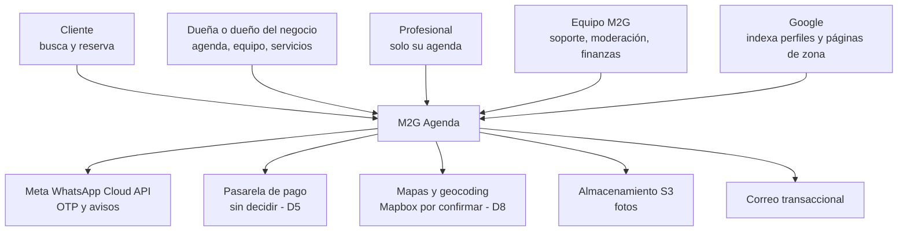
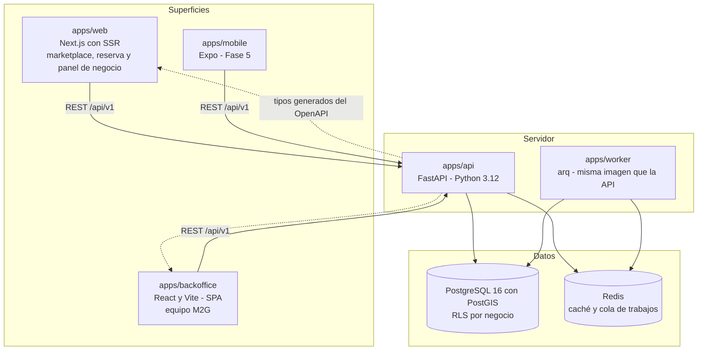
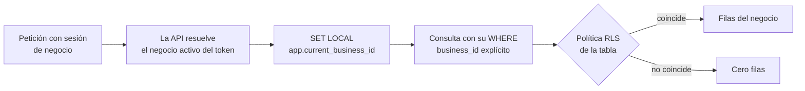
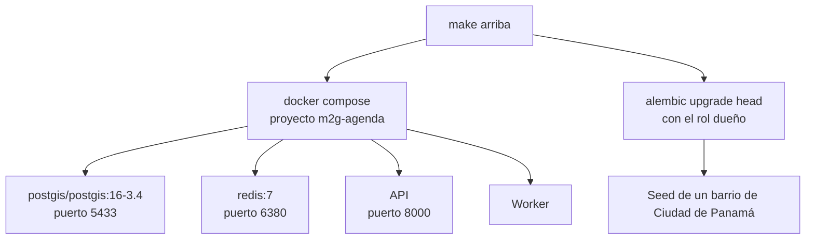

# Diagramas del sistema — Estado: completado (Fase 0)

> El dibujo de qué habla con qué. No sustituye a los [ADR](adr/): explica **dónde vive cada
> decisión** para quien llega nuevo y necesita ubicarse antes de leer catorce fichas.
>
> El despliegue **no es de este equipo** (ver [`PROMPT-CONSTRUCTOR.md`](../../PROMPT-CONSTRUCTOR.md)):
> los diagramas describen las piezas y el entorno local, no la topología de producción, que
> decide el equipo de plataforma.

---

## 1. Contexto: quién usa esto y con quién habla



**Los cinco servicios externos tienen implementación de desarrollo** (ADR-0005, ADR-0007,
ADR-0010). Sin una sola credencial, el entorno local arranca y las pruebas pasan. Esa es la
razón por la que no hay ninguno bloqueando la Fase 1.

---

## 2. Contenedores: las piezas que se ejecutan



Tres cosas de este dibujo que son decisiones, no casualidades:

- **La web no habla con la base de datos**, ni siquiera desde el servidor de Next. Todo pasa por
  la API. Una segunda ruta de acceso duplicaría las reglas de aislamiento, y ahí es exactamente
  por donde se escapan los datos (ADR-0011).
- **El worker no es otro proyecto**: comparte imagen y código con la API, y se distingue por el
  comando que arranca (ADR-0008).
- **Los tipos del cliente son generados**, no escritos: un cambio de contrato rompe en
  compilación y no en el navegador de alguien (ADR-0012).

---

## 3. El recorrido de una reserva, de punta a punta

Es el camino que más importa del producto, y el único donde una carrera entre dos personas
tiene consecuencias reales.

```mermaid
sequenceDiagram
    actor C as Cliente
    participant W as apps/web
    participant A as API
    participant M as Motor de disponibilidad
    participant DB as PostgreSQL
    participant Q as Cola de avisos
    participant WA as WhatsApp

    C->>W: elige servicios y profesional
    W->>A: GET disponibilidad del rango
    A->>M: horario ∩ horario − ocupación − buffers
    M->>DB: lee ocupación del profesional
    DB-->>M: filas que solapan la ventana
    M-->>A: huecos ofrecibles
    A-->>W: horas con su profesional
    Note over C,W: mirar no aparta nada;<br/>el hueco se compite al confirmar

    C->>W: confirma una hora
    W->>A: POST reserva con Idempotency-Key
    A->>DB: inserta reserva y ocupación en una transacción

    alt el hueco sigue libre
        DB-->>A: aceptado
        A->>Q: encola aviso con clave de idempotencia
        Q->>WA: envía la confirmación
        A-->>W: reserva confirmada
    else otra persona se adelantó
        DB-->>A: violación de exclusión 23P01
        A-->>W: 409 SLOT_NO_DISPONIBLE
        W-->>C: ese horario se acaba de ocupar, recarga los huecos
    end
```

La rama de la derecha es la que justifica media arquitectura: **quien decide no es el código,
es la base de datos** (ADR-0004). El error se traduce a un mensaje que una persona entiende y
**no se reintenta en silencio**, porque reservar otra hora en nombre de alguien es peor que el
error.

---

## 4. Cómo se aísla un negocio de otro



`SET LOCAL` y no `SET`: muere con la transacción, así que una conexión devuelta al pool no
arrastra el negocio del usuario anterior. Y el rol de la aplicación **no es dueño de las tablas
ni tiene `BYPASSRLS`**, porque el dueño se salta sus propias políticas sin que nada falle
(ADR-0002).

---

## 5. El entorno local



El nombre de proyecto de Compose es **explícito** (`m2g-agenda`): en esta casa ya ha pasado que
un `docker compose up` en un repo recreara el Postgres de otro por compartir el nombre por
defecto. Los puertos también están desplazados (5433 y 6380) para poder trabajar con otro repo
levantado a la vez.

---

## 6. Lo que este dibujo todavía no tiene

- **La topología de producción**: entornos, réplicas, copias de seguridad y CDN los decide el
  equipo de plataforma. Aquí solo se garantiza que las piezas se levantan con un comando.
- **`apps/mobile`**: es Fase 5 y **no se crea vacío**.
- **El buscador**: la búsqueda del marketplace se resuelve con PostgreSQL y PostGIS. Si algún
  día hiciera falta un motor de búsqueda aparte, será un ADR nuevo y otra caja en el diagrama.
