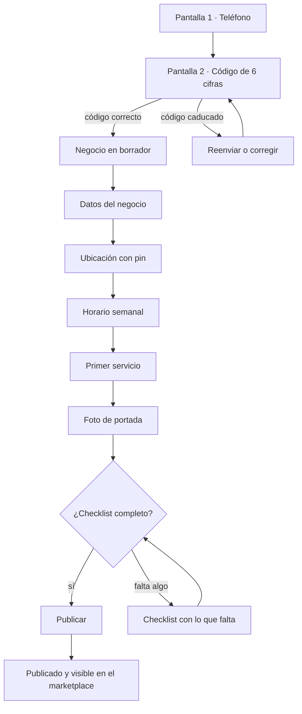
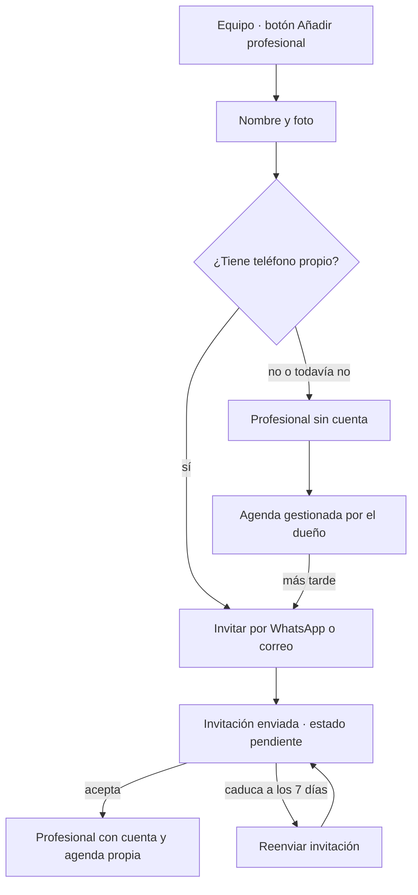
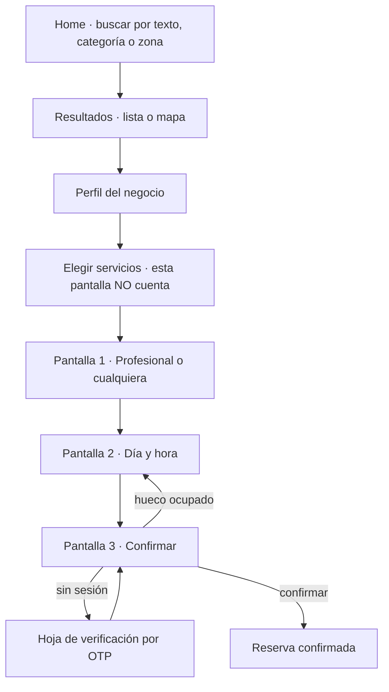
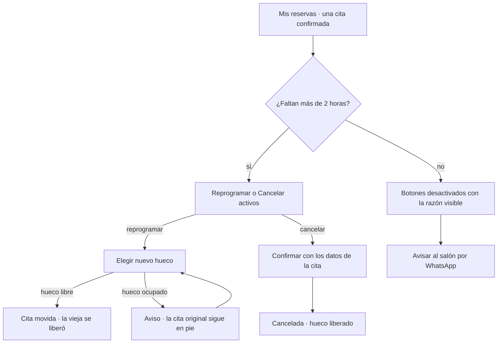

# Flujos de usuario — fases 1 y 2 · Estado: en proceso

> Los recorridos completos de las fases 1 y 2, pantalla a pantalla: qué ve la persona, qué decide,
> qué llama por debajo y qué pasa cuando algo sale mal. Es el documento que el Mockuper y el
> frontend usan como guion; los endpoints citados son los de
> [`../arquitectura/fase-3-contratos-api.md`](../arquitectura/fase-3-contratos-api.md) y la mecánica
> de huecos es la de [`../arquitectura/fase-3-motor-disponibilidad.md`](../arquitectura/fase-3-motor-disponibilidad.md).
>
> Aquí no se decide nada nuevo. Cuando este documento y el brief digan cosas distintas, **manda el
> brief**; las tensiones reales que he encontrado están anotadas al final de cada flujo con el
> prefijo **Tensión**.

---

## 0. Cómo se lee esto

**Las tres superficies.** El panel del negocio y el marketplace viven los dos en `apps/web`
(ADR-0011) y comparten sesión; el cambio a «modo negocio» es explícito (ONB-3). El back-office de
M2G es Fase 3 y no aparece en estos flujos. La app nativa es Fase 5, pero **todo lo que se diseña
aquí tiene que caber en una pantalla de teléfono**, porque el criterio de «hecho» de la Fase 1 es
que un salón real opere su agenda entera desde el móvil.

**El vocabulario es el de `context/restricciones.md`** y no se negocia: negocio, profesional,
servicio, reserva, slot, zona, patrocinado. En la interfaz también: el botón dice «Reservar», no
«Agendar»; la lista dice «Profesionales», no «Empleados».

**Los datos de ejemplo son de un salón panameño de verdad.** A lo largo del documento uso
*Barbería El Cangrejo* (dos profesionales, Kevin y Yaritza) y *Salón Marisol* en San Francisco, con
servicios reales: «Corte + barba · 45 min · $18», «Balayage · 3 h · desde $120», «Manicure
semipermanente · 1 h 15 · $25», «Corte de niño · 25 min · $10». Con «Servicio 1 · 100,00» no se ve
que un balayage de tres horas no cabe en el hueco de las 17:00.

**Una convención sobre el tiempo.** Todas las horas que se muestran son locales del negocio
(`America/Panama` en v1). La API devuelve instantes con desplazamiento explícito y la interfaz
nunca hace aritmética de husos por su cuenta (ADR-0003).

**Los seis estados de una reserva**, con el color que les corresponde en las tres superficies:

| Estado | Cuándo | Quién lo provoca |
|---|---|---|
| `pendiente` | El negocio tiene la auto-confirmación apagada | Sistema |
| `confirmada` | Default: la reserva nace confirmada (D10) | Sistema |
| `completada` | El negocio marca que la cita ocurrió | Negocio |
| `no_show` | El cliente no apareció | Negocio |
| `cancelada_cliente` | El cliente canceló dentro de su ventana | Cliente |
| `cancelada_negocio` | El negocio canceló, dentro o fuera de ventana | Negocio |

Las dos cancelaciones comparten color —hay cinco colores para seis estados— y se distinguen por la
etiqueta y por el evento en el historial. Está explicado en
[`DESIGN-SYSTEM.md`](DESIGN-SYSTEM.md).

---

## 1. Flujo A · Registro de negocio self-service en menos de diez minutos

**Requisitos:** ONB-2, ONB-6, ONB-7, D11, PAY-1.
**Superficie:** `apps/web`, a 390 px, sin tarjeta y sin que nadie de M2G intervenga.

El objetivo temporal manda sobre todo lo demás. Diez minutos desde un teléfono son, siendo
generosos, unas **seis pantallas cortas y ninguna que obligue a buscar un papel**. Por eso el RUC,
los datos fiscales y los atributos filtrables **no están en el alta**: se piden después, desde el
checklist, cuando ya hay algo que perder.

### A.1 Las pantallas

| # | Pantalla | Qué ve | Qué decide | Llamada |
|---|---|---|---|---|
| 1 | **Teléfono** | Un campo de teléfono con prefijo `+507` prefijado y una línea que dice para qué se usa | Su número | `POST /auth/otp/solicitar` |
| 2 | **Código** | Seis casillas, el número al que se envió y un contador de reenvío | — | `POST /auth/otp/verificar` |
| 3 | **Datos del negocio** | Nombre, categoría principal y hasta dos secundarias del catálogo de M2G | Cómo se llama y qué es | `POST /negocios` |
| 4 | **Dónde estás** | Mapa con el pin en la posición del GPS, dirección editable y **zona sugerida** ya rellenada | Mover el pin si el GPS falló | `PUT /negocio/ubicacion` |
| 5 | **Cuándo abres** | Semana con un horario propuesto de lunes a sábado, 9:00–19:00, y domingo cerrado | Ajustar días y horas | `PUT /negocio/horario` |
| 6 | **Tu primer servicio** | Nombre, duración y precio. Duración por defecto 30 min | Qué vende | `POST /negocio/servicios` |
| 7 | **Una foto** | Cámara o galería, una sola foto de portada | — | `POST /negocio/media` |
| 8 | **Listo para publicar** | El checklist con los cuatro requisitos en verde y el botón «Publicar» | Publicar ahora o seguir editando | `GET /negocio/checklist` · `POST /negocio/publicar` |

La categoría sale de `GET /catalogo/categorias`, que es público y cacheable: en 3G no se puede pagar
una sesión para pintar un desplegable.

**Nada de esto se pierde.** Cada pantalla guarda al avanzar, no al final. Si el teléfono se muere en
la pantalla 5, al volver a entrar el negocio está en `borrador` con lo que ya se había escrito y el
checklist dice exactamente qué falta. Un formulario largo que se pierde entero es la forma más
rápida de perder un negocio en el minuto ocho.

### A.2 El diagrama

### A.3 Cuando sale mal

**El OTP no llega.** Es el fallo más caro del producto entero: pasa antes de que el negocio tenga
nada invertido, así que abandona sin dolor. La secuencia es escalonada y visible:

1. Durante los primeros 30 s el botón de reenvío está apagado con un contador. Un botón activo que
   no hace nada porque el servidor limita por teléfono produce tres pulsaciones y ninguna
   explicación.
2. A los 30 s, «Reenviar por WhatsApp».
3. A los 60 s, aparece **«Enviármelo por SMS»**. El SMS es fallback de OTP y solo eso (D14, NTF-1):
   cuesta dinero, así que no es la primera opción, pero tiene que existir porque hay teléfonos en
   Panamá sin WhatsApp activo o con el número de WhatsApp distinto del de la línea.
4. A los 120 s, «Cambiar el número», que vuelve a la pantalla 1 con el número escrito para
   corregir un dígito.

El mensaje de error **nunca dice si el número existe o no**: eso convertiría el endpoint en un
verificador de altas. Y el límite por teléfono e IP devuelve un `429` que la interfaz traduce a
«Has pedido varios códigos seguidos. Prueba de nuevo en un minuto», con el tiempo real, no con un
«inténtalo más tarde».

**El GPS pone el pin en el mar.** Pasa dentro de un local con paredes gruesas. El mapa arranca
centrado en la mejor estimación disponible, pero el pin es **arrastrable desde el primer segundo** y
hay un buscador de dirección encima. Si la precisión reportada supera los 200 m, un aviso dice
«Arrastra el pin a tu puerta» en vez de dar por buena la posición. La zona se recalcula al soltar el
pin y **es editable**: la taxonomía de zonas es jerárquica (MKT-6) y el dueño sabe mejor que el
geocodificador si está en Obarrio o en Bella Vista.

**Se cae la conexión a mitad.** Cada pantalla guarda al avanzar y las escrituras llevan
`Idempotency-Key`. Si la petición no vuelve, la interfaz reintenta con la misma clave: se crea un
negocio, no dos. Mientras reintenta, el botón muestra «Guardando…» y **no se bloquea la navegación
hacia atrás**, porque el borrador ya está.

**Intenta publicar sin el mínimo.** `POST /negocio/publicar` rechaza y devuelve qué falta. La
interfaz no muestra un error genérico: lleva al checklist con los cuatro requisitos de D11 en su
estado real, y cada línea que falta es un enlace directo a la pantalla que la resuelve.

| Requisito | Si falta, el checklist dice |
|---|---|
| 1 servicio activo | «Añade al menos un servicio con su precio y duración» |
| Horario | «Dinos qué días y a qué horas abres» |
| Ubicación | «Coloca el pin en tu puerta» |
| 1 foto | «Sube una foto de tu local o de tu trabajo» |

**El negocio ya existe con ese teléfono.** Una cuenta puede ser cliente y tener rol en varios
negocios (ONB-3). Si el teléfono verificado ya tiene una membresía de dueño, la pantalla 3 no crea
un negocio a ciegas: pregunta «¿Quieres entrar a Barbería El Cangrejo o registrar otro negocio?».

> **Tensión.** El brief pide «operativo en menos de 10 minutos» y también checklist con impacto en
> el ranking (ONB-7). Son compatibles solo si el alta pide el mínimo y el checklist empuja el resto
> **después** de publicar. Lo he diseñado así; si Luis quiere pedir el RUC en el alta, el objetivo
> de diez minutos se cae.

---

## 2. Flujo B · Catálogo de servicios y equipo

**Requisitos:** SRV-1, SRV-2, SRV-3, SRV-4, STF-1, STF-2, ONB-4.

Este flujo ocurre casi siempre **después** de publicar, en ratos muertos entre clientes. Eso
gobierna el diseño: todo tiene que poder hacerse en tramos de dos minutos y sobrevivir a que el
teléfono se bloquee a la mitad.

### B.1 Añadir un servicio

Una hoja modal sobre la lista, no una pantalla nueva: el dueño está comparando con lo que ya tiene.

| Campo | Comportamiento |
|---|---|
| Nombre | Libre. «Corte + barba» |
| Categoría global | Del catálogo de M2G (SRV-4). Es lo que hace que el servicio sea filtrable en el marketplace, y se explica con esa frase |
| Duración | Selector de pasos de 5 min, no un campo de texto. Escribir «45» en un teclado numérico dentro de un salón es más lento que dar tres toques |
| Precio | Tres modos: **fijo**, **desde** y **a consultar**. «Balayage · desde $120» es lo normal en el mercado real, no la excepción |
| Buffers antes y después | Plegados bajo «Ajustes avanzados», con un ejemplo concreto: «10 min después para barrer y desinfectar» |
| Foto, orden, activo | Opcionales |

Las **variantes** (SRV-2) son una lista simple dentro del servicio, cada una con su duración y su
precio propios: «Balayage · media melena · 2 h 30 · $120» y «Balayage · pelo largo · 3 h 30 ·
$160». El override de duración por profesional es v2 y no aparece en la interfaz; tampoco un hueco
deshabilitado que insinúe que llega.

**Errores reales.** Un servicio cuya duración más sus buffers no cabe en ningún tramo de la jornada
se guarda igual, pero la lista lo marca con un aviso: «Este servicio no cabe en tu horario actual».
No se bloquea el guardado —el dueño puede estar a punto de cambiar el horario— pero tampoco se le
deja descubrirlo tres días después porque nadie reserva. Es el caso 5 del motor visto desde la
interfaz.

### B.2 Invitar a un profesional

**El profesional «sin cuenta» no es un caso degradado, es el caso frecuente.** El dueño de la
barbería añade a Kevin el lunes por la mañana con un nombre y una foto, y Kevin no se entera hasta
que alguien se lo explica en el descanso. Ese profesional tiene ficha, horario propio, servicios
asignados y ocupa agenda; lo único que no tiene es acceso. La conversión posterior es enviar la
invitación desde su ficha, y **las reservas históricas se mantienen** porque cuelgan del perfil de
profesional, no de la cuenta de usuario.

**Asignar servicios** es una lista de casillas dentro de la ficha (`PUT
/negocio/profesionales/{id}/servicios`). Por defecto, un profesional nuevo presta **todos** los
servicios activos: es lo que quiere el 80 % de los salones y desmarcar es más rápido que marcar
doce cosas.

**El horario propio** se rellena con el del negocio y se ajusta desde ahí. Que sea distinto es el
caso normal (Yaritza solo trabaja de tarde), así que la interfaz no lo trata como una excepción
escondida: la ficha muestra el horario efectivo resultante —la intersección con el del negocio— en
una línea de resumen, porque un profesional con horario de 8:00 a 20:00 en un negocio que abre a las
9:00 no trabaja a las 8:00 y hay que verlo.

**Errores.** Invitar a un teléfono que ya es profesional en el mismo negocio devuelve un error claro
sin duplicar la ficha. Invitar a alguien que ya trabaja en **otro** negocio es v2 (STF-4, D17): la
invitación se rechaza con «Esta persona ya tiene una cuenta de profesional en otro negocio» y se
ofrece crearlo como profesional sin cuenta, que sí funciona hoy.

---

## 3. Flujo C · El día a día del salón

**Requisitos:** AGD-2, AGD-3, AGD-4, RSV-3, RSV-5, RSV-6.
**Superficie:** el móvil del dueño, en la mano, entre cliente y cliente.

Esta es la pantalla que decide si el producto se usa. Todo lo demás se abre una vez al mes.

### C.1 La agenda del día

Al entrar en modo negocio, la primera pantalla es **hoy**, no un panel de bienvenida ni un
dashboard con métricas. Una petición por rango (`GET /negocio/agenda`), no una por día: siete
peticiones para pintar una semana es lo que hunde la experiencia en 3G.

La estructura, de arriba abajo: una barra con el día y flechas de día anterior y siguiente; si hay
más de un profesional, una fila de pestañas con sus nombres y un «Todos»; y la lista de citas en
orden cronológico. **La lista, no una cuadrícula de horas.** Una cuadrícula a 390 px con dos
profesionales da columnas de 150 px donde no cabe ni el nombre del cliente; y las horas muertas
gastan pantalla sin decir nada. La cuadrícula es la vista de escritorio, donde además vive el
arrastrar y soltar (AGD-2).

Cada fila es: la hora de inicio y la de fin en cifras tabulares, el nombre del cliente, el servicio
con su duración, el profesional si se está viendo «Todos», y el color del estado. **La fila entera
es el objetivo táctil**, no un icono a la derecha.

Los huecos libres entre citas **se muestran** como una línea tenue con la duración: «45 min
libres». Es la información que el dueño usa cuando alguien entra por la puerta y pregunta.

### C.2 Reserva manual de walk-in o de teléfono

Es la acción principal del panel y por eso tiene un botón permanente. El flujo es de una sola hoja
modal, porque quien la usa tiene a alguien delante esperando:

1. **Servicio** — lista de los servicios activos con su duración y precio, los más usados arriba.
2. **Cuándo** — dos atajos, «Ahora» y «Siguiente hueco», más un selector de hora. «Ahora» es el
   caso real del walk-in y se salta la antelación mínima: esa regla protege al negocio de las
   reservas del marketplace, no al negocio de sí mismo.
3. **Quién** — el profesional, preseleccionado si se estaba viendo su agenda.
4. **Cliente** — buscador sobre la ficha de clientes del negocio y, debajo, **«Cliente rápido»**:
   nombre y teléfono, nada más. Un walk-in no rellena un perfil.

Se confirma con `POST /negocio/reservas`. La reserva manual **compite por el hueco igual que las
demás** y puede recibir un `409`; ver C.5.

**Tensión con el teléfono verificado.** D9 exige teléfono verificado para reservar y prohíbe la
reserva como invitado, pero eso aplica al **cliente que reserva desde el marketplace**. Un walk-in
al que le apuntan la cita no verifica nada: es el negocio quien responde por ese dato. Lo he
diseñado así porque lo contrario haría inusable el caso principal de la Fase 1, y lo dejo anotado
porque el brief no lo dice con estas palabras.

### C.3 Mover una cita

Desde la fila, «Mover». Se abre el selector de fecha y hora **con los huecos reales del mismo
profesional**, y por debajo es `PATCH /negocio/reservas/{id}`, que libera el hueco viejo y ocupa el
nuevo en la misma transacción. Si el nuevo falla, **el viejo no se libera**: la cita se queda donde
estaba y la persona ve «Ese horario acaba de ocuparse», no una cita desaparecida.

Al mover se ofrece —marcado por defecto— avisar al cliente por WhatsApp. Es una casilla y no un
automatismo silencioso, porque mover la cita de las 10:00 a las 10:15 mientras el cliente está
sentado en la silla no merece un mensaje.

En escritorio esto es arrastrar y soltar sobre la cuadrícula, con la misma llamada y las mismas
consecuencias.

### C.4 Marcar completada o no-show

Ambas son `POST /negocio/reservas/{id}/estado` y cada cambio deja evento (RSV-3).

**Completada** aparece como acción sugerida en la fila **a partir de la hora de fin de la cita**, no
antes. Antes es ruido; después es un toque.

**No-show** vive detrás de un menú de la fila, nunca pegado a «Completada». Confundir las dos cuesta
caro: el contador de no-shows del cliente (RSV-5) puede acabar bloqueándolo. Pide confirmación —«Se
sumará al contador de este cliente»— y **es reversible** desde el historial de la reserva mientras
sea el mismo día.

**Cancelar por el negocio** está en el mismo menú, separado por una línea, en color de peligro, y
ofrece avisar al cliente con el motivo. Un salón que cierra porque se fue la luz cancela ocho citas
seguidas: la acción admite selección múltiple desde la vista de día.

### C.5 Cuando sale mal

**El hueco se ocupó mientras decidías.** Es la carrera del motor vista desde el panel. Un cliente
del marketplace confirmó a las 15:00 mientras el dueño rellenaba la hoja del walk-in. La API
devuelve `409 SLOT_NO_DISPONIBLE` y la interfaz **no reintenta sola** (§4 del motor: reservar otro
hueco en nombre de nadie es meterle una cita a alguien sin que la haya elegido). Lo que hace es:
conservar todo lo escrito, refrescar los huecos, y mostrar sobre el selector «Ese horario se acaba
de ocupar» con los dos huecos libres más cercanos como sugerencia tocable. Nada de un diálogo que
cierra la hoja y obliga a empezar de cero.

**No hay cobertura.** El panel guarda en caché la agenda del día (APP-5) y la muestra con una banda
superior discreta: «Sin conexión · visto a las 14:32». Las acciones de escritura no se pierden: se
encolan con su `Idempotency-Key` y la fila afectada se pinta en estado pendiente de envío con un
indicador propio. **Nunca se pinta como confirmado algo que no ha llegado al servidor**: un dueño
que cree tener la cita movida y no la tiene es peor que un error honesto. Al recuperar red se
envían en orden; si alguna choca con un `409`, se muestra como conflicto pendiente de resolver, sin
descartarla en silencio.

**El horario cambió y hay reservas fuera.** `PUT /negocio/horario` no borra nada: avisa. La
pantalla, tras guardar, lista las reservas que quedan fuera del nuevo horario con nombre, hora y
servicio, y da tres salidas por cada una: dejarla como está, moverla, o cancelarla avisando al
cliente. **Dejarla como está es la opción por defecto y es válida**: las citas siguen en la agenda
aunque el negocio ya no abra a esa hora. Es el caso 4 del motor.

**Bloqueos.** El almuerzo de todos los días es un bloqueo recurrente y el martes que Yaritza va al
médico es puntual (AGD-3). Se crean desde la agenda tocando un hueco libre, y la interfaz distingue
las dos cosas con una pregunta sola: «¿Solo este día o todos los martes?».

### C.6 La ficha del cliente

Desde cualquier cita, el nombre del cliente lleva a su ficha **en este negocio** (`GET
/negocio/clientes/{id}`): historial de reservas con sus estados, notas libres del negocio, y el
contador de no-shows. Las notas son del negocio y no las ve el cliente; la interfaz lo dice con una
línea, porque alguien va a escribir ahí «no le gusta hablar» y tiene que saber quién lo lee. Datos
de salud es v2 con consentimiento (RSV-6) y no hay campo para ello: si lo hubiera, se usaría.

**Aislamiento.** La ficha es por negocio. El mismo cliente en Barbería El Cangrejo y en Salón
Marisol son dos fichas con dos historiales y dos contadores, y ninguna consulta cruza el límite
(ADR-0002). El contador de no-shows **no es global**, y eso es deliberado: un contador global
convertiría el producto en una lista negra compartida sin que nadie lo haya decidido.

---

## 4. Flujo D · Reserva por el cliente desde el marketplace

**Requisitos:** RSV-1, RSV-2, MKT-1, MKT-2, MKT-4, D9, D10, D13.
**La regla dura:** máximo **tres pantallas tras elegir servicio**.

### D.1 El recorrido completo

**Cómo cuentan las tres pantallas.** Elegir servicios es parte del perfil del negocio y no cuenta:
la cuenta empieza *tras* elegir servicio, que es lo que dice RSV-1. Quedan profesional, hora y
confirmación. Y cuando el negocio tiene **un solo profesional** —el caso más común en Panamá, la
barbería de una persona— la pantalla de profesional **se salta entera**: son dos.

**La verificación por OTP no es una cuarta pantalla, y es a propósito.** Es una hoja modal que sube
sobre la de confirmación, con el teléfono y las seis casillas, y al verificar vuelve exactamente
donde estaba con la reserva lista para confirmar. Sacarla a pantalla completa antes de reservar
—«regístrate para continuar»— es el patrón que pierde a la mitad de la gente en el paso donde ya
había decidido. D9 exige teléfono verificado y prohíbe reservar como invitado; esto lo cumple sin
gastar un paso del presupuesto de RSV-1.

> **Tensión.** Es la lectura que hago de RSV-1 más D9: si Luis cuenta la hoja de OTP como pantalla,
> hay que fusionar profesional y hora en una sola, y eso empeora la elección de hora. Lo dejo
> señalado.

### D.2 Buscar

La home lleva un campo de texto, la ubicación —GPS, dirección escrita o zona— y las categorías
como accesos directos. La búsqueda se renderiza en servidor la primera vez, porque es indexable y
porque en 3G una lista que aparece con el HTML gana a una que espera al JavaScript (ADR-0011).

Cada resultado es: foto, nombre, categoría, **distancia**, rating con número de reviews, rango de
precios y la primera hora libre de hoy si la hay. Los patrocinados van **intercalados y
etiquetados «Patrocinado»**, máximo 2 de cada 10, y **nunca ocultan a los orgánicos** (MKT-4). La
etiqueta se lee sin ambigüedad y no se disfraza de badge decorativo.

Los filtros —distancia, precio, rating, atributos, disponibilidad real, abierto ahora, métodos de
pago (MKT-2)— viven en una hoja modal con un botón de aplicar, no se aplican al vuelo. Cada filtro
aplicado se refleja en una fila de chips retirables sobre los resultados: en un teléfono, un filtro
que no se ve es un filtro que el usuario olvidó y luego culpa a la búsqueda.

**Sin resultados.** No se muestra una lista vacía. Se dice qué filtro está apretando —«8 negocios en
San Francisco, ninguno con hueco hoy»— y se ofrece la salida concreta: quitar el filtro de
disponibilidad, ampliar la distancia, o ver la primera fecha con huecos.

### D.3 El perfil y la elección de servicios

Botón «Reservar» siempre visible (NEG-3), fijo al pie y no perdido tras el scroll de la galería. El
número de teléfono **no aparece en texto plano** en ningún sitio: el contacto es un botón de
WhatsApp que resuelve en servidor (`GET /publico/negocios/{slug}/chat`), registra el clic y
redirige. Si el número estuviera en el HTML, alguien raspa la base entera de negocios en una tarde.

La lista de servicios permite **seleccionar varios** (D13, RSV-2): «Corte + barba» y «Cejas» se
suman en un pie que muestra duración total y precio total en cifras tabulares. Los servicios
encadenados van con **el mismo profesional y en un bloque continuo**; profesionales distintos es
v2 y la interfaz no lo sugiere. Si dos servicios seleccionados no los presta ningún profesional a la
vez, se avisa **al seleccionar el segundo**, no al llegar a la pantalla de horas: «Kevin hace corte
y barba; el manicure lo hace Yaritza. Reserva por separado».

La **política de cancelación se muestra antes de reservar**, no después. Es requisito legal, y va
en el pie de la pantalla de confirmación, en texto legible, no en un enlace.

### D.4 Pantalla 1 · El profesional

Lista con foto, nombre y, arriba del todo, **«Cualquiera disponible»**, que es la opción que da más
huecos y por eso va primera. Se salta si hay un solo profesional. Cada profesional muestra si tiene
huecos hoy, para que la elección no sea a ciegas.

Con «cualquiera», el reparto **equilibra carga** (STF-5) y la pantalla de confirmación dice con
quién ha quedado: nadie va a un salón a que le atienda «cualquiera», va a que le atienda una
persona, y quiere saber su nombre antes de salir de casa.

### D.5 Pantalla 2 · El día y la hora

Arriba, una tira horizontal de siete días con la marca de cuáles tienen huecos. Debajo, los slots
del día elegido en una rejilla de tres columnas, agrupados por franja: mañana, tarde, noche. Las
horas van en cifras tabulares para que las columnas se alineen.

Una petición por **rango**, no una por día (`GET /publico/negocios/{slug}/disponibilidad`), y al
tocar otro día se pinta de lo ya cargado. Los slots **no se apartan ni se bloquean temporalmente**
(ADR-0004): esta pantalla informa, no promete, y por eso el error de D.7 no es un fallo sino el
funcionamiento normal.

**El negocio no tiene huecos esta semana.** No se muestra una rejilla vacía con siete días
tachados. La pantalla dice **«El primer hueco es el jueves 11 a las 10:15»** y salta ahí con un
toque. Si tampoco hay nada en los sesenta días de antelación máxima, se dice eso mismo y se ofrece
el botón de WhatsApp: un negocio sin huecos no es un negocio roto, es uno lleno, y mandar a la
persona a preguntar es mejor que dejarla mirando un calendario muerto.

### D.6 Pantalla 3 · Confirmar

Todo en una vista sin scroll: negocio, día y hora, profesional, servicios con duración y precio
total, la política de cancelación, y el botón. Debajo del botón, una línea con la ventana real de
ese negocio: «Puedes cancelar sin coste hasta 2 horas antes».

`POST /mi/reservas` con `Idempotency-Key`. Con auto-confirmación (D10, el default) la reserva nace
`confirmada` y la pantalla de éxito ofrece **añadir al calendario** con el `.ics` (RSV-7) y volver
al perfil. Si el negocio tiene la auto-confirmación apagada, nace `pendiente` y el mensaje lo dice
con esas palabras: «El salón tiene que confirmarla. Te avisamos por WhatsApp».

### D.7 Cuando sale mal

**El hueco se ocupó mientras decidías.** `409 SLOT_NO_DISPONIBLE`. La interfaz vuelve a la pantalla
2, recarga los huecos y muestra arriba, sin diálogo que haya que cerrar: «Las 15:00 se acaban de
ocupar. Estos son los huecos que quedan». **La selección de servicios y de profesional se
conserva.** No se reserva automáticamente el hueco siguiente.

**Se cae la conexión al confirmar.** La petición lleva `Idempotency-Key` y la interfaz reintenta con
la **misma** clave hasta tres veces con espera creciente. Dos reintentos crean **una** reserva y
devuelven la misma respuesta (caso 18 del motor). Mientras reintenta, el botón dice «Confirmando…»
y **no se puede pulsar otra vez**; si tras los reintentos no hay respuesta, se muestra «No pudimos
confirmar. Revisa tus reservas» con un enlace al historial, porque puede haberse creado igual y
decirle «falló» a alguien que sí tiene cita es peor que la duda.

**El OTP no llega en la hoja de verificación.** La misma escalera que en A.3 —reenviar a 30 s, SMS a
60 s, cambiar número a 120 s— pero **sin salir de la hoja**: la reserva elegida sigue debajo, viva.
Si el proceso pasa de unos minutos, al volver puede haberse ocupado el hueco; en ese caso se cae en
el error anterior con todo conservado menos la hora.

**El negocio se suspendió o despublicó entre la búsqueda y la confirmación.** Devuelve error de
negocio no disponible; la interfaz lo dice sin jerga y lleva a resultados similares en la misma
zona, no a la home vacía.

---

## 5. Flujo E · Cancelar y reprogramar por el cliente

**Requisitos:** RSV-4, RSV-3, RSV-7.
**Ventana por defecto:** 2 h, configurable por negocio en `GET /negocio/ajustes`.

### E.1 Dentro de la ventana

Desde «Mis reservas», la cita lleva dos acciones: **Reprogramar** y **Cancelar**, separadas y con
pesos visuales distintos —cancelar no es una acción secundaria disfrazada de enlace, pero tampoco
comparte fila con la primaria.

**Reprogramar** reutiliza la pantalla 2 del flujo D con el mismo servicio y el mismo profesional, y
por debajo es `POST /mi/reservas/{id}/reprogramar`: libera el viejo y ocupa el nuevo en una
transacción. **Si el nuevo falla, el viejo no se libera** y el mensaje es «Ese horario acaba de
ocuparse. Tu cita de las 15:00 sigue en pie». Esa segunda frase es la que evita la llamada al salón.

**Cancelar** pide confirmación con los datos completos de la cita —día, hora, negocio— porque la
lista puede tener cinco y el pulgar se equivoca. La reserva pasa a `cancelada_cliente`, el hueco
vuelve a ofrecerse de inmediato (caso 11 del motor) y el negocio recibe aviso.

### E.2 Fuera de la ventana

Faltan menos de dos horas. Los dos botones **siguen visibles pero desactivados**, con la razón al
lado: «Ya no puedes cancelar en línea, faltan menos de 2 horas». Esconderlos hace que la persona los
busque por toda la pantalla y acabe pensando que la app está rota.

Debajo, la única salida real: **«Avisar al salón por WhatsApp»**, que abre el chat resuelto en
servidor con un mensaje prerredactado y editable. Quien no puede ir a las 15:00 va a avisar de
alguna manera; si el producto no le da una, lo hace por Instagram o no lo hace, y eso es un no-show.

**El límite se comprueba en el servidor, siempre.** La interfaz desactiva el botón por cortesía,
pero el reloj del teléfono puede estar mal y la ventana se calcula donde se decide. Una cancelación
que llega tarde recibe un error de ventana cerrada y la interfaz cambia a la vista de fuera de
ventana sin recargar la página.

---

## 6. Flujo F · Dejar una review

**Requisitos:** REV-1, REV-2, REV-5, REV-6.

**Solo con reserva completada, una por reserva, dentro de la ventana de 14 días.** Las tres
condiciones se comprueban en el servidor (`POST /mi/reservas/{id}/review`) y las tres se explican en
la interfaz cuando bloquean algo, porque «no puedes valorar» sin motivo se lee como un fallo.

El disparador es la solicitud automática tras la cita (REV-6): un WhatsApp unas horas después de
que el negocio marque `completada`, con enlace directo. **La reserva tiene que estar completada, no
solo pasada**: si el salón no marcó nada, no se pide review, y esa es una razón más para que marcar
completada sea un toque en la fila (C.4).

La pantalla es corta a propósito: cinco estrellas grandes —objetivo táctil de 44 px cada una, no
iconos de 20 px pegados—, un campo de texto opcional, fotos opcionales, y una casilla para valorar
también al profesional (REV-2). Se envía con una sola acción.

**Cuando sale mal.**

- **Ventana caducada.** «Pasaron los 14 días para valorar esta cita». Sin botón muerto.
- **Ya hay una review.** Se muestra la que ya escribió, con la respuesta del negocio si la hay
  (REV-3). Editar no está en v1 y no se insinúa.
- **La cita no está completada.** No aparece la acción. Si llega por el enlace del WhatsApp a una
  reserva que el negocio revirtió, se explica: «Esta cita no figura como completada».
- **Se cae la conexión al enviar.** Se conserva el texto escrito y las fotos en el dispositivo y se
  reintenta; perder tres párrafos que alguien tecleó con el pulgar es una review que no se vuelve a
  escribir.

El rating agregado del perfil es **bayesiano** (REV-5) y la interfaz nunca muestra «5,0» con una
sola review: muestra el valor ponderado y el número real de reviews al lado. Y el patrocinio no
toca el rating ni oculta reviews. Jamás (ADS-7).

---

## 7. Catálogo de errores transversales

Los mismos fallos aparecen en varios flujos. Se resuelven igual en todos, y el texto es el mismo
palabra por palabra: un error que se dice de tres maneras distintas parece tres errores distintos.

| Situación | Qué se muestra | Qué NO se hace |
|---|---|---|
| `409` hueco ocupado | Aviso en su sitio, huecos recargados, selección conservada | Reservar otro hueco por su cuenta; cerrar la hoja; perder lo escrito |
| OTP que no llega | Escalera de 30 s reenviar, 60 s SMS, 120 s cambiar número | Decir si el número existe; activar el reenvío antes de que el servidor lo permita |
| `429` por límite | «Prueba de nuevo en N segundos», con N real | «Inténtalo más tarde» |
| Sin conexión | Banda con la hora del último dato; escrituras encoladas con su indicador | Pintar como confirmado lo que no llegó al servidor |
| Petición sin respuesta | Reintento con la **misma** `Idempotency-Key`, hasta tres veces | Reintentar con clave nueva y duplicar |
| Sesión caducada | Hoja de verificación sobre lo que estaba haciendo, y vuelve ahí | Expulsar a la home y perder el contexto |
| Sin resultados | Qué filtro aprieta y la salida concreta | Una lista vacía |
| Permiso denegado | «Tu rol de profesional no incluye esto» | Un 403 crudo; o esconder la opción sin explicarla |

Dos reglas sobre el texto de error, que valen para todos: **decir qué pasó y qué hacer ahora**, en
ese orden y en esa frase; y **nunca culpar a la persona**. «Ese horario se acaba de ocupar» es
información; «selección inválida» es un reproche por algo que no hizo mal.

---

## 8. Lo que se ve a 390 px

Esta sección es una restricción, no una ilustración. Un teléfono de gama media en 3G, dentro de un
salón, con las manos ocupadas. El presupuesto vertical real es de unos **640 px útiles** en un
iPhone de 390 × 844 con la barra del navegador visible, y hay que contar con que el teclado se come
la mitad cuando aparece.

**Las tres reglas que salen de ahí:**

1. **La acción principal no hace scroll.** O está en el primer pantallazo, o está fija al pie.
2. **Lo que no cabe, se corta con una señal, no con un abismo.** La última fila visible se ve a
   medias: es lo que le dice al pulgar que hay más.
3. **Nada de barras dobles.** Cabecera y una sola fila de contexto. Cada barra fija es una cita
   menos en pantalla.

### 8.1 Agenda del día

| Zona | Alto | Qué lleva |
|---|---|---|
| Cabecera | 56 px | Nombre del negocio abreviado y acceso al menú |
| Barra de día | 48 px | «Hoy, lun 8 sep», flechas de día anterior y siguiente |
| Pestañas de profesional | 40 px | Solo si hay más de uno. Con uno, esta barra no existe |
| Lista de citas | resto | Filas de 72 px |
| Botón «Nueva reserva» | flotante | Fijo abajo a la derecha, 56 px |

**Entran seis citas completas y la séptima a medias.** Una jornada real de barbería tiene entre ocho
y catorce citas, así que hay scroll y es correcto que lo haya: lo que no puede pasar es que el
dueño no vea la siguiente cita al desbloquear el teléfono. Por eso, al abrir, la lista **se
posiciona en la cita en curso o en la próxima**, no en las 9:00 de la mañana a las cuatro de la
tarde.

**Qué entra en una fila de 72 px:** hora de inicio y de fin en cifras tabulares a la izquierda en
columna fija; nombre del cliente en el tamaño de cuerpo; servicio y duración en el tamaño menor y
color suave; una barra de 3 px del color del estado en el borde izquierdo.

**Qué se sacrifica:**

- **La cuadrícula horaria.** A 390 px con dos profesionales no cabe. Es vista de escritorio.
- **El precio de la cita.** No se decide nada con él en la agenda; está en el detalle.
- **Los huecos libres de menos de 15 minutos.** No se listan: no se puede reservar nada ahí y
  gastan una fila.
- **Los avatares de los profesionales.** En la vista «Todos» va el nombre en texto, que se lee de
  reojo; una foto de 24 px no distingue a Kevin de Yaritza en el espejo retrovisor.
- **Las métricas del día.** Ingresos, ocupación y demás no van arriba de la agenda. Van en otra
  pantalla, y en la Fase 1 puede que ni eso.

### 8.2 Resultado de búsqueda

| Zona | Alto | Qué lleva |
|---|---|---|
| Barra de búsqueda | 56 px | Texto y ubicación actual, tocable para cambiarla |
| Chips de filtro | 44 px | Los aplicados, retirables, con scroll horizontal |
| Alternar lista y mapa | dentro de la barra | Un control, no una barra propia |
| Tarjetas | resto | 132 px cada una |

**Entran cuatro resultados y el quinto asomando.** Con el máximo de 2 patrocinados por cada 10
(MKT-4), eso significa que **en el primer pantallazo puede haber como mucho uno**, y va etiquetado.
Si el primer pantallazo fuera todo patrocinado, la regla estaría rota en la práctica aunque se
cumpliera en la paginación.

**Qué entra en una tarjeta de 132 px:** foto cuadrada de 96 px a la izquierda; nombre en el tamaño
mayor; categoría y **distancia** en una línea; rating con número de reviews; y una última línea con
el rango de precios o la primera hora libre de hoy. La etiqueta «Patrocinado» va sobre el nombre,
legible.

**Qué se sacrifica:**

- **La galería.** Una foto por resultado, no un carrusel. Un carrusel por tarjeta en 3G son
  cuarenta imágenes que nadie mira.
- **La lista de servicios.** Va en el perfil. En resultados basta el rango de precios.
- **Los atributos.** Estacionamiento, idiomas y métodos de pago son filtros, no adornos de la
  tarjeta.
- **El mapa simultáneo.** Lista **o** mapa, alternando. Media pantalla de mapa deja dos resultados
  visibles y ninguna de las dos cosas sirve.
- **La descripción del negocio.** Ni una línea. No diferencia a nadie en una lista.

### 8.3 Elegir hora

| Zona | Alto | Qué lleva |
|---|---|---|
| Cabecera con retroceso | 56 px | Nombre del negocio |
| Resumen de lo elegido | 64 px | Servicios, duración total y profesional, tocable para cambiarlo |
| Tira de días | 72 px | Siete días con marca de disponibilidad, scroll horizontal |
| Rejilla de slots | resto | Tres columnas, botones de 48 px, separación de 8 px |
| Pie fijo | 64 px | «Continuar» con la hora elegida, desactivado hasta que haya una |

**Entran seis filas de slots: dieciocho horas sin hacer scroll**, con la cabecera de franja de
mañana ocupando una. Para un día normal de barbería con granularidad de 15 minutos es
aproximadamente la mañana entera, y el resto queda a un scroll corto.

**Qué se sacrifica:**

- **La vista de mes.** Siete días y adelante. Un calendario mensual a 390 px da celdas de 50 px que
  no admiten marca de disponibilidad legible, y además nadie reserva la peluquería a 40 días.
- **El nombre del profesional en cada slot.** Con «cualquiera», el nombre se ve en la confirmación,
  no repetido dieciocho veces.
- **El precio dentro de cada slot.** Está en el resumen de arriba, que no se mueve.
- **Las animaciones al cambiar de día.** El contenido aparece; no se desliza. En un teléfono de
  gama media una transición de 300 px de ancho se ve a tirones y retrasa la lectura.

**Y lo que no se sacrifica nunca, en las tres pantallas:** el objetivo táctil de 44 px, las cifras
tabulares en horas y precios, el estado de la reserva legible sin depender solo del color, y que
la acción principal esté al alcance del pulgar sin hacer scroll.
